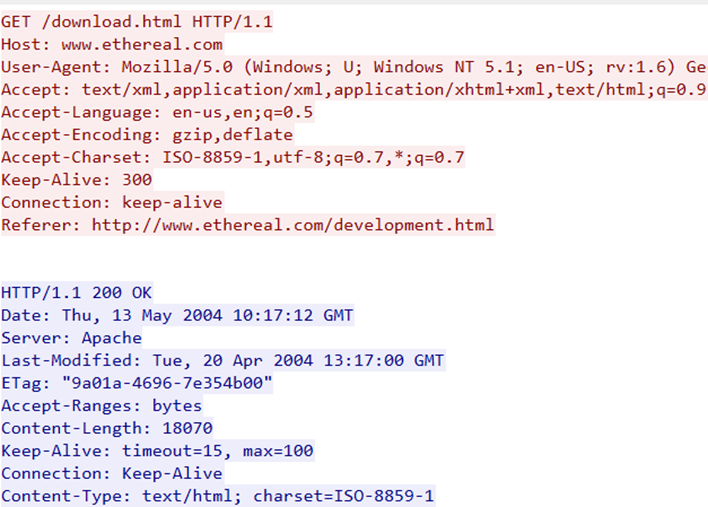
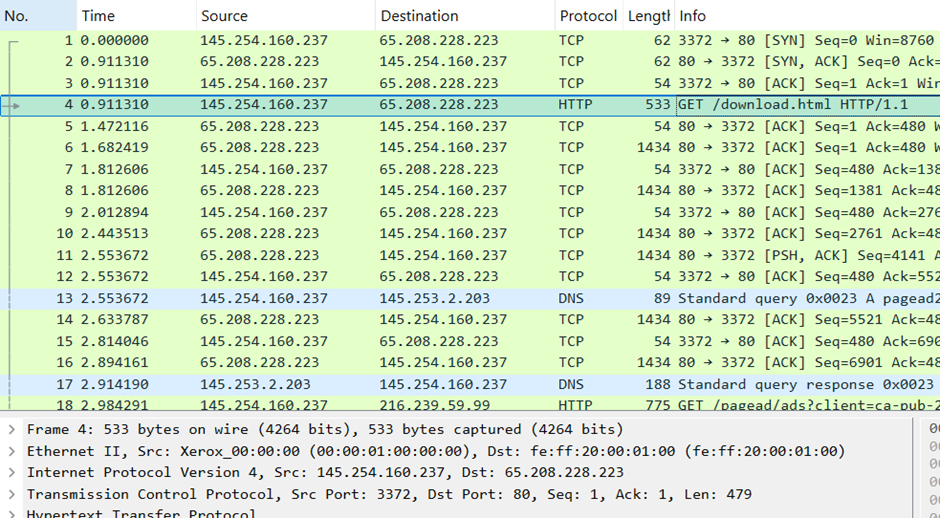
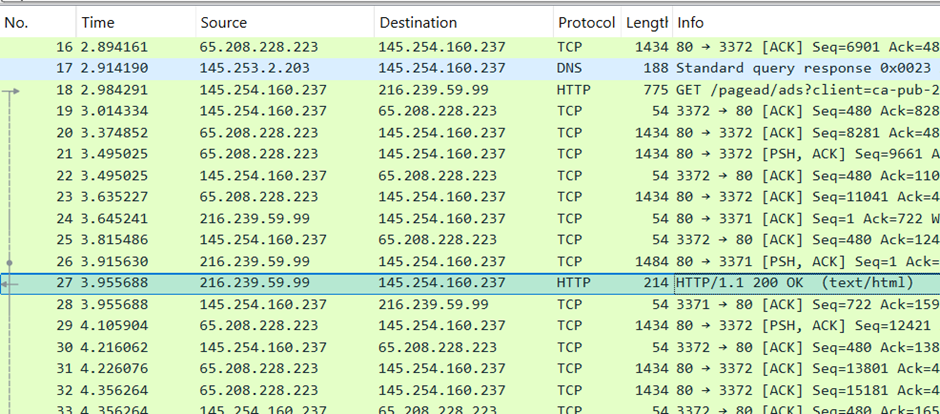
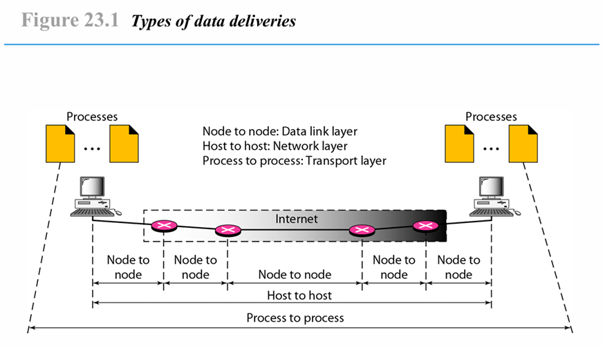
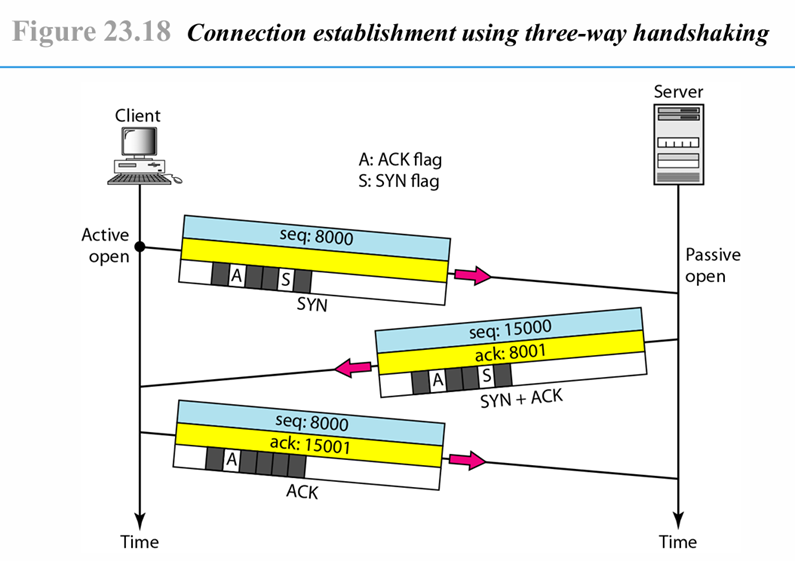
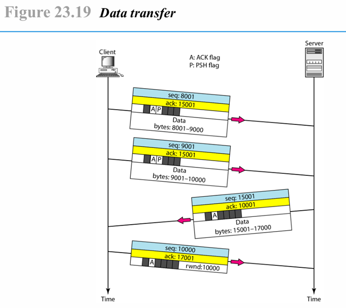
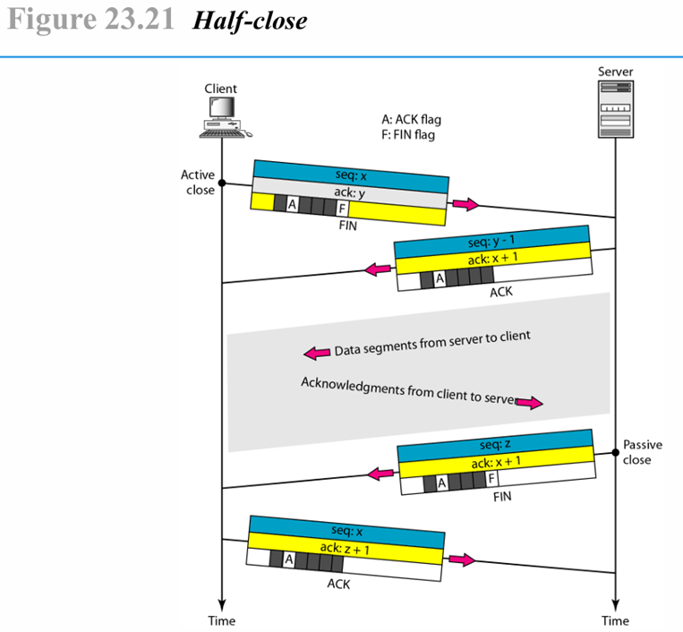

  <h1 style="text-align: center;font-weight: bold">LAPORAN RESMI WORKSHOP ADMINISTRASI JARINGAN</h1>

 

  
  <h4 style="text-align: center;">Dosen Pengampu : Dr. Ferry Astika Saputra, S.T., M.Sc.</h4>
  <h3 style="text-align: center;">Disusun Oleh : </h3>
  

    <strong>Nama : Achmad Risel Araby</strong> 
    <strong>Kelas : 2 D3 IT A</strong> 
    <strong>NRP : 3123500025</strong>
  

<h3 style="text-align: center;line-height: 1.5">Politeknik Elektronika Negeri Surabaya Departemen Teknik Informatika Dan Komputer Program Studi Teknik Informatika 2024/2025</h3>
  

## LAPORAN WORKSHOP 1: WIRESHARK ANALYSIS

### 1.	Analisa file http.cap dengan wireshark : Versi HTTP yang digunakan, IP address dari client maupun server, waktu dari client mengirimkan HTTP request., Waktu dari server mengirinmkan server dan berapa durasinya.

Jawaban :

Versi HTTP yang digunakan adalah 1.1.

IP address client 145.254.160.237 dan server 65.208.228.223.

Waktu client mengirimkan HTTP request adalah 0,911310.

Waktu server mengirimkan response adalah 3,955688, durasi dari saat client mengirimkan request hingga server mengirimkan response adalah 3.044378.

### 2. Deskripsi gambar pada slide.

Jawaban :

Process to Process – Transport Layer

Merupakan komunikasi antar aplikasi atau proses di dua perangkat yang berbeda. Lapisan ini bertanggung jawab atas pengiriman data dari satu proses ke proses lainnta menggunakan protokol seperti TCP atau UDP.

Host to Host – Network Layer

Merupakan komunikasi antar dua perangkat (host) melalui jaringan. Lapisan ini menangani pengalamatan dan perutean data dari satu host ke host lainnya menggunakan protokol seperti IP.

Node to Node – Data Link Layer

Merupakan komunikasi antar perangkat jaringan individual, seperti router atau switch yang berada diantara dua host. Lapisan ini menangani transmisi data antar node dalam satu segmen jaringan menggunakan protokol ethernet atau Wi-Fi.

### 3. Rangkuman tahapan komunikasi menggunakan TCP.

Jawaban :

Three-way handshake adalah proses yang digunakan oleh TCP untuk membangun koneksi yang andal antara klien dan server dalam tiga langkah. Pertama, klien mengirimkan paket SYN ke server dengan nomor urut awal (misalnya, seq: 8000) untuk meminta koneksi. Kedua, server merespons dengan SYN-ACK, mengirimkan nomor urutnya sendiri (misalnya, seq: 15000) dan mengakui nomor urut klien dengan ack: 8001. Ketiga, klien mengonfirmasi dengan ACK, mengirimkan ack: 15001 sebagai tanda bahwa koneksi telah berhasil dibangun. Proses ini memastikan sinkronisasi nomor urut dan kesiapan kedua pihak sebelum bertukar data, sehingga komunikasi menjadi andal dan bebas dari kesalahan.

Setelah koneksi TCP terbentuk melalui three-way handshake, proses transmisi data dimulai dengan klien mengirimkan segmen pertama berisi data dengan nomor urut seq: 8001 dan ack: 15001, mencakup data dari byte 8001–9000. Segmen kedua dikirim dengan seq: 9001 dan ack: 15001, membawa data dari byte 9001–10000. Setelah menerima dua segmen ini, server membalas dengan segmen data sendiri dengan seq: 15001, ack: 10001, dan mengirimkan data dari byte 15001–17000. Terakhir, klien mengonfirmasi penerimaan dengan mengirimkan segmen seq: 10000, ack: 17001, dan menyertakan rwnd: 10000 yang menunjukkan ukuran jendela penerimaan (receiver window), menandakan berapa banyak data tambahan yang bisa diterima. Proses ini menunjukkan mekanisme TCP dalam memastikan data dikirim dalam urutan yang benar, diterima dengan akurat, dan menyesuaikan aliran data berdasarkan kapasitas penerima.

Terminasi koneksi TCP menggunakan mekanisme three-way handshake dimulai ketika pihak yang ingin menutup koneksi (aktif close), dalam hal ini klien, mengirimkan segmen dengan FIN flag yang memiliki sequence number (seq: x) dan acknowledgment number (ack: y) ke server, menandakan bahwa klien tidak akan mengirim lebih banyak data. Server, yang melakukan passive close, merespons dengan segmen yang memiliki FIN + ACK flag, di mana seq: y dan ack: x + 1, mengonfirmasi penerimaan permintaan terminasi dari klien sekaligus menyatakan bahwa server juga siap menutup koneksi. Terakhir, klien mengirimkan segmen ACK terakhir dengan seq: x dan ack: y + 1, menandakan bahwa seluruh proses terminasi telah selesai, dan kedua pihak dapat mengosongkan sumber daya yang terkait dengan koneksi tersebut.

## KESIMPULAN
Pada praktikum kali ini kami telah mereview Kembali materi mengenai OSI layer, Analisa menggunakan wireshark, dan tahapan komunikasi menggunakan TCP. Kemudian kami juga mempraktikkan Kembali cara menganalisa menggunakan wireshark yang hasilnya kami tulis pada soal nomor 1 di laporan ini. Dengan mereview kembali materi semester kemarin semoga dapat memudahkan langkah kami untuk mempelajari materi baru pada mata kuliah Workshop Administrasi Jaringan.