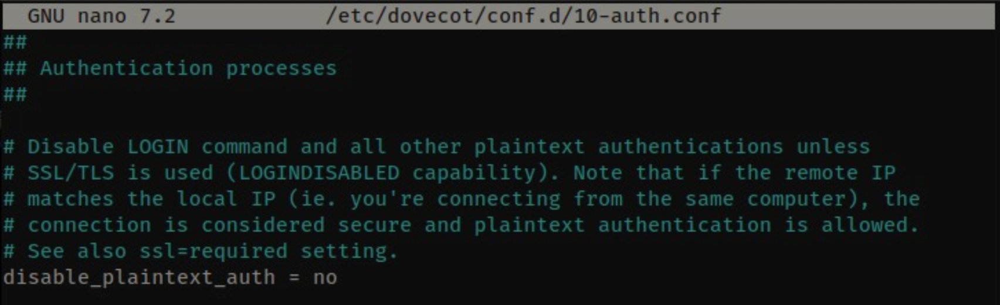
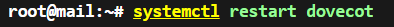

  <h1 style="text-align: center;font-weight: bold">LAPORAN RESMI WORKSHOP ADMINISTRASI JARINGAN</h1>

 

  
  <h4 style="text-align: center;">Dosen Pengampu : Dr. Ferry Astika Saputra, S.T., M.Sc.</h4>
  <h3 style="text-align: center;">Disusun Oleh : </h3>
  

    <strong>Nama : Achmad Risel Araby</strong> 
    <strong>Kelas : 2 D3 IT A</strong> 
    <strong>NRP : 3123500025</strong>
  

<h3 style="text-align: center;line-height: 1.5">Politeknik Elektronika Negeri Surabaya Departemen Teknik Informatika Dan Komputer Program Studi Teknik Informatika 2024/2025</h3>
  

## LAPORAN WORKSHOP 12: KONFIGURASI MAIL SERVER (Kelompok 1)

Praktikum ini bertujuan untuk melakukan konfigurasi Mail Server di jaringan internal network dari masing-masing kelompok. Kemudian, mengujinya dengan mengirim dan menerima mail antar kelompok. Berikut langkah-langkah konfigurasinya.

### Install & Setup Postfix

Postfix adalah sebuah mail transfer agent (MTA) open-source yang digunakan untuk mengirim, menerima, dan meneruskan email melalui jaringan internet. Postfix dirancang dengan fokus pada keamanan, stabilitas, dan kompatibilitas dengan berbagai sistem operasi Unix/Linux. Ia bekerja berdasarkan protokol SMTP (Simple Mail Transfer Protocol) dan sering digunakan sebagai pengganti sendmail yang lebih aman dan efisien. Postfix juga dapat diintegrasikan dengan layanan lain seperti Dovecot untuk autentikasi pengguna dan manajemen mailbox.

1. Konfigurasi untuk email spam (Opsional)
    

### Install & Setup Dovecot

Dovecot adalah server email open-source yang berfungsi sebagai mail delivery agent (MDA) dan IMAP/POP3 server yang digunakan untuk menerima, menyimpan, dan memberikan akses terhadap kotak surat pengguna. Dovecot dirancang untuk aman, cepat, dan mudah dikonfigurasi, serta sering digunakan bersama Postfix dalam membangun sistem email server lengkap. Ia memungkinkan pengguna untuk membaca email mereka melalui aplikasi klien seperti Thunderbird atau Outlook menggunakan protokol IMAP atau POP3.

1. Install dovecot

2. Edit file /etc/dovecot/dovecot.conf dan hapus komen di line listen = *, ::

3. Izinkan autentikasi menggunakan password biasa (plaintext)

4. Menentukan mekanisme autentikasi yang didukung

5. Edit file /etc/dovecot/conf.d/10-mail.conf dan ubah lokasi email di maildir

6. Edit file /etc/dovecot/conf.d/10-master.conf dan konfigurasi seperti digambar

7. Restart layanan dovecot

### Email Client Setting

1. Masuk ke Thunderbird, inputkan nama, email, dan password dari mail yang telah dibuat

2. Konfigurasi incoming dan upcoming server seperti berikut

3. Jika berhasil, mail dari langkah 3 akan muncul

4. Tes untuk menulis dan membaca mail

Dengan mengikuti langkah-langkah percobaan dari server-world dan menampilkan output seperti diatas, maka konfigurasi mail server telah berhasil.