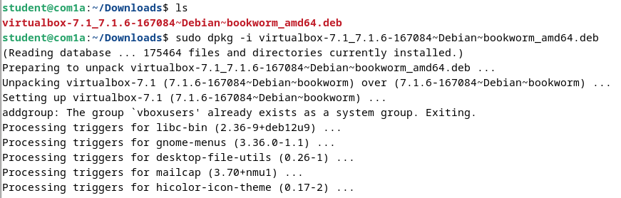

  <h1 style="text-align: center;font-weight: bold">LAPORAN RESMI WORKSHOP ADMINISTRASI JARINGAN</h1>

 

  
  <h4 style="text-align: center;">Dosen Pengampu : Dr. Ferry Astika Saputra, S.T., M.Sc.</h4>
  <h3 style="text-align: center;">Disusun Oleh : </h3>
  

    <strong>Nama : Achmad Risel Araby</strong> 
    <strong>Kelas : 2 D3 IT A</strong> 
    <strong>NRP : 3123500025</strong>
  

<h3 style="text-align: center;line-height: 1.5">Politeknik Elektronika Negeri Surabaya Departemen Teknik Informatika Dan Komputer Program Studi Teknik Informatika 2024/2025</h3>
  

## LAPORAN WORKSHOP 2.1: INSTALASI VIRTUAL BOX & DEBIAN

### 1. Boot ke Debian OS

Melalui BIOS kita mengubah bootable OS nya yang awalnya dari UEFI Windows ke Legacy Debian.

### 2. Koneksi ke Wired Network dan Cek IP

Dengan perintah ip a, kita cek apakah sudah mendapatkan IP setelah koneksi ke wired network berhasil. Pada gambar tersebut kita dapatkan IPv4 10.252.108.101 dan IPv6 fe80::529a:4cff:fe09:b4b5.

### 3. Download File Virtual Box dan Install

Pertama kita download terlebih dahulu file instalasi Virtual Box dari situs resminya https://www.virtualbox.org/wiki/Downloads, kemudian di terminal kita ketikkan perintah *sudo dpkg -i namafile* untuk menjalankan instalasi. Dari hasil instalasi pada gambar tersebut, terlihat berjalan lancar dan tanpa adanya kendala atau error apapun.

### 4. Fixing Error Can't Enumerate USB Device

Setelah instalasi berhasil, selanjutnya kita buka virtual boxnya. Namun saat kita buka, terdapat error yang berbunyi *Can't Enumerate USB Device*, itu karena user kita (student) belum terdaftar dalam group vboxusers, untuk mendaftarkannya kita perlu mengetikkan perintah *sudo usermod -a -G vboxusers $USER*, setelah itu kita restart device kita lalu buka kembali virtual box, maka error akan hilang.

### 5. Download Debian OS ISO dan Install di Virtual Box

Pertama kita download iso debian melalui website resminya https://www.debian.org/, kemudian kita buka virtual box dan tambahkan virtual os baru, kita beri nama *Debian-12* dan pilih file iso yang telah kita download tadi. Selanjutnya kita atur penggunaan ram 2gb dan jumlah cpu 2 core. Selanjutnya kita atur penggunaan storage sebesar 10gb, dan klik finish. Selanjutnya kita buka Debian-12 dan tunggu hingga proses instalasi virtual os selesai.

Dan proses instalasi virtual os telah berhasil dijalankan.

## KESIMPULAN

Pada praktikum kali ini kami mempelajari bagaimana cara berpindah OS melalui BIOS, melakukan solving permasalahan Wired Network dan mendapatkan IPnya, melakukan instalasi virtual box dan memperbaiki error can't enumerate USB drive, dan menginstal virtual os debian serta menjalankannya. Praktikum ini adalah langkah awal dalam proses pembelajaran Administrasi Jaringan kedepannya. 