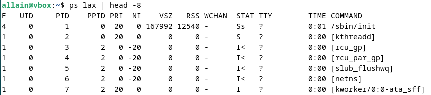

  <h1 style="text-align: center;font-weight: bold">LAPORAN RESMI WORKSHOP ADMINISTRASI JARINGAN</h1>

 

  
  <h4 style="text-align: center;">Dosen Pengampu : Dr. Ferry Astika Saputra, S.T., M.Sc.</h4>
  <h3 style="text-align: center;">Disusun Oleh : </h3>
  

    <strong>Nama : Achmad Risel Araby</strong> 
    <strong>Kelas : 2 D3 IT A</strong> 
    <strong>NRP : 3123500025</strong>
  

<h3 style="text-align: center;line-height: 1.5">Politeknik Elektronika Negeri Surabaya Departemen Teknik Informatika Dan Komputer Program Studi Teknik Informatika 2024/2025</h3>
  

## LAPORAN WORKSHOP 2.2: 

### Chapter 4: Process Control

#### Komponen Sebuah Proses
Proses terdiri dari address space (ruang alamat) dan struktur data kernel. Address space merupakan kumpulan halaman memori (biasanya 4KiB atau 8KiB) yang digunakan untuk menyimpan kode program, data, dan stack . Sementara itu, struktur data kernel mencatat status proses (misalnya: berjalan, tertidur), prioritas, parameter penjadwalan, sumber daya yang digunakan (CPU, memori), file atau port jaringan yang terbuka, signal mask , dan identitas pengguna (user ID).

Thread adalah konteks eksekusi dalam proses yang berbagi address space dan sumber daya yang sama. Thread memungkinkan paralelisme efisien dengan overhead lebih rendah dibandingkan proses mandiri. Sebagai contoh, web server menggunakan banyak thread untuk menangani permintaan klien secara bersamaan. Setiap thread menangani satu permintaan, tetapi seluruh proses tetap menggunakan sumber daya yang sama, sehingga meningkatkan efisiensi layanan.

#### PID (Process ID Number)
PID adalah bilangan bulat yang ditetapkan oleh kernel saat proses dibuat. PID digunakan untuk merujuk ke proses dalam berbagai system call , seperti mengirim sinyal ke proses.

#### PPID (Parent Process ID Number)
Setiap proses memiliki parent process (proses induk) yang menciptakannya. Nomor PPID adalah PID dari proses induk tersebut. PPID digunakan untuk merujuk ke proses induk dalam system call , seperti mengirim sinyal ke induk proses.

#### UID dan EUID (User ID dan Effective User ID)
UID (User ID) adalah identitas pengguna yang memulai proses. EUID (Effective User ID) menentukan hak akses proses ke sumber daya seperti file, port jaringan, dan lainnya. EUID mengontrol izin akses, sementara UID mengidentifikasi pemilik proses.

#### Siklus Hidup Suatu Proses
Proses baru dibuat menggunakan sistem panggilan fork , yang menggandakan proses induk (parent) untuk membentuk proses anak (child). Proses anak memiliki PID unik dan informasi akuntansi sendiri, meskipun secara teknis Linux menggunakan clone (versi lebih canggih dari fork) untuk menangani thread dan fitur tambahan. Fork tetap dipertahankan untuk kompatibilitas mundur.

Saat sistem booting, kernel membuat proses awal seperti init (atau systemd pada sistem modern) dengan PID 1. Proses ini menjalankan skrip startup dan menjadi leluhur semua proses lain di sistem. Perbedaan implementasi antara UNIX dan Linux terletak pada cara menjalankan skrip startup, tetapi semua proses non-kernel berasal dari proses primordial ini.

Sinyal adalah cara untuk mengirimkan notifikasi ke suatu proses. Sinyal digunakan untuk memberitahu proses bahwa suatu peristiwa tertentu telah terjadi.

Ada sekitar 30 jenis sinyal yang berbeda, dan digunakan dalam berbagai cara:
- Dapat dikirim antarproses sebagai sarana komunikasi.
- Dapat dikirim oleh driver terminal untuk menghentikan, menginterupsi, atau menangguhkan proses ketika tombol seperti <Ctrl+C> atau <Ctrl+Z> ditekan.
- Dapat dikirim oleh administrator (dengan perintah kill) untuk mencapai berbagai tujuan, seperti menghentikan proses.
- Dapat dikirim oleh kernel ketika proses melakukan pelanggaran (misalnya, pembagian dengan nol).
- Dapat dikirim oleh kernel untuk memberitahu proses tentang kondisi "menarik", seperti berakhirnya proses anak (child process ) atau ketersediaan data pada saluran I/O.

Sinyal KILL, INT, TERM, HUP, dan QUIT terdengar seperti memiliki makna serupa, tetapi penggunaannya sebenarnya berbeda:
- KILL : Hentikan proses secara paksa (tidak bisa diblokir/ditangani).
- INT (Ctrl+C): Permintaan hentikan operasi, biasa digunakan untuk keluar dari program.
-TERM : Perintah hentikan proses secara aman (proses bisa membersihkan diri sebelum keluar).
- HUP : Sinyal "putus" terminal, sering dipakai untuk memuat ulang konfigurasi daemon.
- QUIT (Ctrl+\): Seperti TERM, tetapi menghasilkan core dump jika tidak ditangani.

#### Kill: Send Signals
Perintah kill paling sering digunakan untuk menghentikan proses. kill dapat mengirim sinyal apa pun, tetapi secara default mengirim sinyal TERM.

**kill [-signal] pid**

signal adalah nomor atau nama simbolis sinyal yang akan dikirim, dan pid adalah nomor identifikasi proses target.

Perintah kill (default TERM) tidak menjamin proses berhenti karena sinyal TERM bisa ditangkap/diabaikan. Sementara kill -9 (KILL) pasti menghentikan proses karena sinyalnya tak terblokir/ditangani.

killall menghentikan proses berdasarkan nama alih-alih ID proses. Contoh:

**killall firefox**

Perintah diatas akan menutup firefox yang telah saya buka.

Perintah pkill mirip dengan killall , tetapi menawarkan lebih banyak opsi. Contoh:

**pkill -u abdoufermat # kill all processes owned by user abdoufermat**

Ketika melakukan pkill terhadap user allain, maka semua aktivitas user akan dihentikan.

### PS: Monitoring Processes
Perintah ps adalah alat utama administrator untuk memantau proses, menampilkan informasi seperti PID, UID, prioritas, terminal kontrol, penggunaan memori/CPU, dan status proses (aktif, berhenti, tidur, dll.). Opsi ps aux menampilkan proses semua pengguna (a), detail lengkap (u), dan proses tanpa terminal (x).

Argumen lain yang berguna adalah lax , yang memberikan informasi teknis lebih detail tentang proses. lax sedikit lebih cepat daripada aux karena tidak perlu menerjemahkan nama pengguna dan grup.

Untuk mencari proses tertentu, Anda bisa menggunakan grep untuk memfilter output ps.

atau pidof:

### Interactive monitoring with top
Perintah top menampilkan pandangan real-time sistem, termasuk ringkasan sumber daya dan daftar proses yang dikelola kernel. Tampilannya dapat dikustomisasi (ukuran, urutan, jenis informasi) dan pengaturannya bisa disimpan permanen. Pembaruan layar default setiap 1-2 detik.

htop adalah alternatif interaktif dengan antarmuka lebih baik, dukungan scroll vertikal/horizontal, tampilan lengkap perintah proses, dan opsi operasi lebih banyak. Membutuhkan ncurses untuk berjalan.

### Nice and renice: changing process priority
Niceness adalah nilai prioritas proses (rentang: -20 (prioritas tertinggi) hingga +19/20 (prioritas terendah)).

Nilai tinggi (misal +19) = prioritas rendah (proses "baik", tidak mengganggu proses lain).
Nilai rendah/negatif (misal -20) = prioritas tinggi (proses kritis, mendapat lebih banyak CPU).
Contoh: Proses CPU-intensif dijalankan dengan nice tinggi agar tidak memperlambat sistem.

Perintah nice digunakan untuk memulai proses dengan nilai kebaikan tertentu. Sintaksnya adalah:

Perintah renice digunakan untuk mengubah nilai kebaikan dari proses yang sedang berjalan. Sintaksnya adalah:

Nilai prioritas adalah prioritas aktual proses yang digunakan oleh kernel Linux untuk menjadwalkan tugas. Dalam sistem Linux, prioritas sistem adalah 0 hingga 139, di mana 0 hingga 99 untuk waktu nyata dan 100 hingga 139 untuk pengguna.

Hubungan antara nilai bagus dan prioritas adalah sebagai berikut:

Nilai default nice adalah 0. Semakin rendah nilai nice, semakin tinggi prioritas proses.

### The /proc filesystem
/proc adalah pseudo-filesystem yang menyimpan informasi sistem dan proses, termasuk detail proses dalam direktori bernama PID.

### Strace and truss
Gunakan strace (Linux) atau truss (FreeBSD) untuk melacak panggilan sistem dan sinyal guna menganalisis atau memperbaiki program.

Sebagai contoh yang berjalan sebagai PID 3361:

top dimulai dengan memeriksa waktu saat ini. Kemudian membuka dan membuat statistik direktori /proc, dan membaca file /proc/1/stat untuk mendapatkan informasi tentang proses init.

### Runaway processes
Proses yang tidak merespons dan menggunakan CPU 100% (runaway process ) menyebabkan sistem lambat. Hentikan dengan perintah kill (gunakan sinyal TERM atau KILL jika diperlukan).

**kill -9 pid** atau **kill -KILL pid**

Gunakan strace/truss untuk analisis proses runaway . Cek penggunaan filesystem dengan df -h; jika penuh, lacak file besar via du dan identifikasi file yang dibuka proses menggunakan lsof.

**lsof -p pid**

### Periodic processes
Cron (disebut crond di RedHat) adalah daemon untuk menjalankan perintah secara terjadwal. Konfigurasi disimpan dalam crontab di /var/spool/cron (Linux) atau /var/cron/tabs (FreeBSD), dieksekusi oleh shell (sh).

**format of crontab**
Format crontab: 5 kolom (waktu/tanggal) diikuti perintah yang dijalankan sesuai interval.

contoh lain:

Berikut jadwalnya: 0,30 * 13 * 5 berarti bahwa perintah akan dijalankan pada 0 dan 30 menit setelah jam ke-13 pada hari Jumat. Jika Anda ingin menjalankan perintah setiap 30 menit, Anda dapat menggunakan jadwal berikut: */30 * * * *.

#### crontab management
Perintah crontab digunakan untuk mengelola jadwal cron:
-e: mengedit crontab,
-l: menampilkan daftar jadwal,
-r: menghapus crontab.

### Systemd timer

Systemd timer (berakhiran .timer) adalah alternatif cron job yang lebih fleksibel. Timer diaktifkan oleh service unit terkait, dapat dipicu berdasarkan waktu, boot sistem, atau event. Kelola timer dengan systemctl list-timers untuk melihat timer aktif.

Pada contoh di atas, unit logrotate.timer dijadwalkan untuk mengaktifkan unit logrotate.service pada tengah malam setiap hari.

Berikut ini adalah tampilan unit logrotate.timer:

Opsi OnCalendar digunakan untuk menentukan kapan timer harus mengaktifkan layanan. Opsi AccuracySec digunakan untuk menentukan akurasi pengatur waktu. Opsi Persistent digunakan untuk menentukan apakah timer harus mengejar waktu yang terlewat.

### Common use for scheduled tasks
 Otomatis mengirim email ke output laporan harian atau hasil eksekusi perintah menggunakan timer cron atau systemd.
 Contohnya :

**Bersihkan sistem**

menggunakan pengatur waktu cron atau systemd untuk menjalankan skrip yang membersihkan sistem berkas.

**Rotating a log file**
Rotasi log adalah pemecahan file log berdasarkan ukuran/tanggal dengan menyimpan versi lama. Proses berulang ini cocok dijadwalkan (misal via cron/systemd timer).

**Running batch jobs**

Batch job cocok untuk proses panjang seperti memproses antrian pesan/database via cron job untuk ETL ke data warehouse.

**Backing up and mirroring**

Gunakan tugas terjadwal (cron/systemd) untuk mencadangkan direktori ke sistem remote via rsync. Mirror adalah salinan persis (byte-for-byte ) filesystem/direktori di sistem lain, diperbarui berkala untuk keperluan backup atau distribusi data.