<div align="center">
  <h1 style="text-align: center;font-weight: bold">LAPORAN RESMI WORKSHOP<br>ADMINISTRASI JARINGAN</h1>
</div>
<br />
<div align="center">
  
  <h4 style="text-align: center;">Dosen Pengampu : Dr. Ferry Astika Saputra, S.T., M.Sc.</h4>
  <h3 style="text-align: center;">Disusun Oleh : </h3>
  <p style="text-align: center;">
    <strong>Nama : Achmad Risel Araby</strong><br>
    <strong>Kelas : 2 D3 IT A</strong><br>
    <strong>NRP : 3123500025</strong>
  </p>

<h3 style="text-align: center;line-height: 1.5">Politeknik Elektronika Negeri Surabaya<br>Departemen Teknik Informatika Dan Komputer<br>Program Studi Teknik Informatika<br>2024/2025</h3>
  <hr><hr>
</div>

## LAPORAN WORKSHOP 2.3: Chapter 5: Process Control


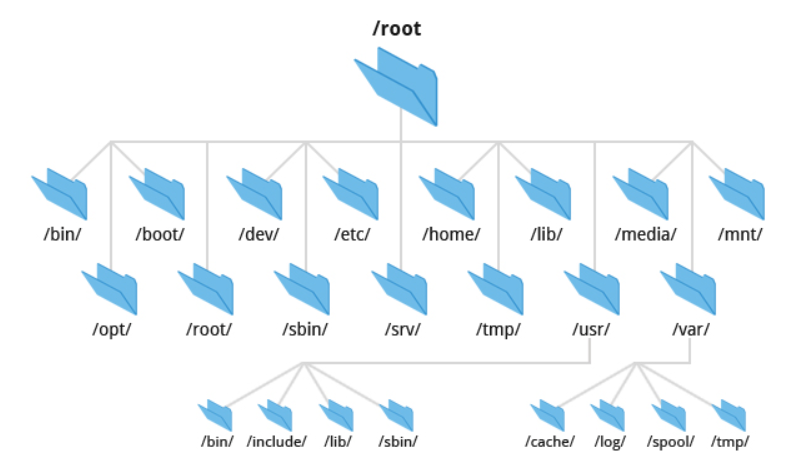
Tujuan utama sistem berkas adalah merepresentasikan dan mengatur sumber daya penyimpanan sistem. Sistem berkas terdiri dari empat komponen utama:

1. Ruang Nama : Cara menamai dan mengorganisir objek dalam hierarki.
2. API : Kumpulan system call untuk navigasi dan manipulasi objek.
3. Model Keamanan : Skema proteksi, penyembunyian, dan berbagi data.
4. Implementasi : Perangkat lunak yang menghubungkan model logis ke perangkat keras.
Sistem berkas disk populer meliputi ext4, XFS, UFS, ZFS (Oracle), Btrfs, VxFS (Veritas), dan JFS (IBM). Sistem berkas asing seperti FAT/NTFS (Windows) dan ISO 9660 (CD/DVD) juga umum digunakan.

Sistem berkas modern umumnya berfokus meningkatkan kecepatan, keandalan, atau menambahkan fitur tambahan di luar semantik standar.

### Pathnames
Istilah "folder" berasal dari sistem Windows/macOS dan merujuk pada direktori (lebih teknis). 

Pathname (jalur berkas) adalah rangkaian direktori yang menunjukkan lokasi berkas. Terdiri dari:
- Absolute (mutlak): Lengkap dari root, contoh: /home/user/file.txt.
- Relative (relatif): Berdasarkan posisi direktori saat ini, contoh: ./file.txt.

### Filesystem Mounting and Unmounting
Sistem berkas tersusun dari bagian-bagian kecil (sub-sistem berkas), masing-masing mencakup satu direktori, subdirektori, dan berkas di dalamnya. Istilah "pohon berkas" digunakan untuk struktur keseluruhan, sedangkan "sistem berkas" merujuk pada cabang yang terpasang pada pohon tersebut.

Sistem berkas umumnya dipasang ke pohon menggunakan perintah mount . Perintah ini mengaitkan titik mount (direktori dalam pohon berkas) dengan root (akar) dari sistem berkas baru.

```
# Mount the filesystem on /dev/sda4 to /users
mount /dev/sda4 /users
```

umount -l : Lepas sistem berkas dari hierarki, tetapi menunggu hingga tidak digunakan.

umount -f : Paksa lepas sistem berkas yang sedang sibuk.

Alternatif : Gunakan lsof/fuser untuk identifikasi proses yang menggunakan sistem berkas sebelum melepasnya.

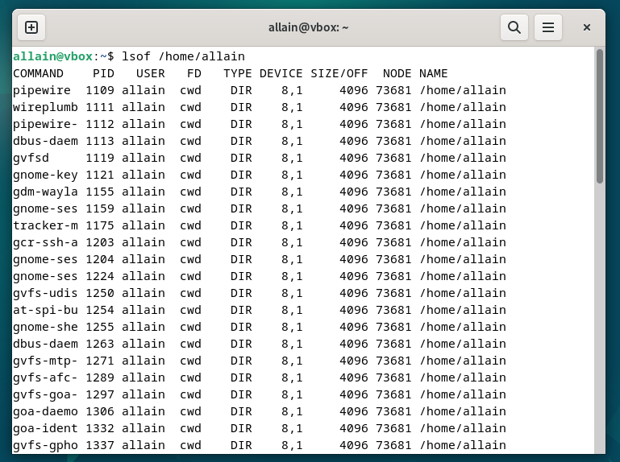

Untuk menyelidiki proses yang menggunakan sistem berkas, Anda dapat menggunakan perintah ps.

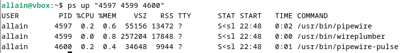

### Organization of the file tree
Sistem berkas root mencakup setidaknya direktori root (/) dan kumpulan berkas/subdirektori minimal. Berkas kernel sistem operasi biasanya berada di /boot. Pada BSD dan beberapa UNIX lain, kernel bukanlah satu berkas tunggal, melainkan kumpulan komponen.

- /etc : Berisi berkas kritis sistem dan konfigurasi.
- /sbin dan /bin : Utilitas penting.
- /tmp : Berkas sementara (kadang digunakan).
- /dev : Dulunya bagian dari root, kini sistem berkas virtual terpisah.
- /lib atau /lib64 menyimpan pustaka (library ) dan komponen seperti C preprocessor . Beberapa sistem memindahkannya ke /usr/lib, terkadang menjadikan /lib sebagai tautan simbolis.
- /usr : Menampung program standar non-kritis, manual, dan pustaka. FreeBSD menyimpan konfigurasi lokal di /usr/local.
- /var : Menyimpan antrian (spool ), log, informasi akuntansi, dan data dinamis lain yang berubah cepat. Kedua direktori ini harus tersedia agar sistem bisa boot ke mode multiuser.

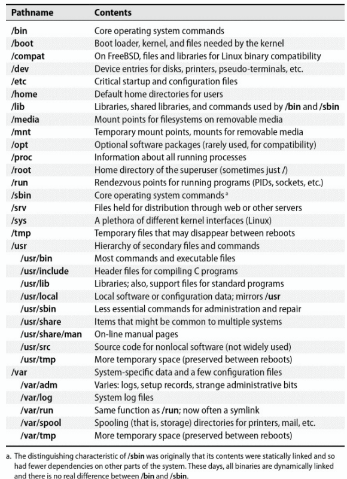

### File types
Sebagian besar implementasi sistem berkas mendefinisikan tujuh jenis berkas:
- Berkas biasa.
- Direktori.
- Berkas perangkat karakter.
- Berkas perangkat blok.
- Socket domain lokal.
- Pipa bernama (FIFO).
- Tautan simbolik.

Gunakan file untuk mengecek jenis berkas.

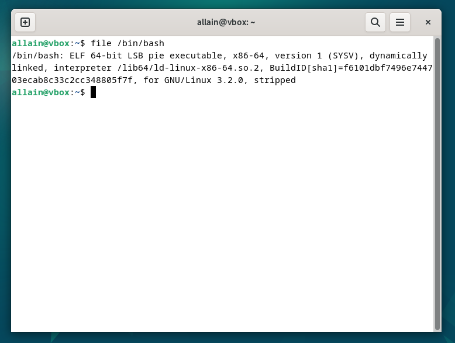

Mnggunakan ls -ld, flag -d memaksa ls untuk menampilkan informasi sebuah direktori, bukan menampilkan isi direktori tersebut.

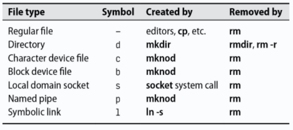

Berkas Biasa : Deretan byte tanpa struktur, termasuk berkas teks, data, program, dll.

Direktori : Referensi nama ke berkas lain.

Hard Link : Berikan nama tambahan ke berkas (buat dengan ln). Opsi ls -i menampilkan jumlah hard link per berkas.

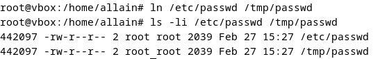

**Character and block device files**

File Perangkat & Driver: File perangkat memungkinkan komunikasi antara program dan perangkat keras. Kernel mengelola driver untuk setiap perangkat menggunakan nomor mayor dan minor sebagai identifikasi.

Perkembangan /dev: Metode lama yang menggunakan mknod dan rm telah digantikan oleh direktori /dev yang dipasang sebagai filesystem khusus, dikelola secara otomatis oleh kernel bersama daemon pengguna.

Komunikasi Antar Proses: Local domain sockets dan named pipes memungkinkan proses yang berjalan di host yang sama untuk saling berkomunikasi.

Symbolic Links: Symbolic links memberikan fleksibilitas dalam menunjuk file atau direktori, memungkinkan satu file memiliki beberapa nama (misalnya, /usr/bin sering merupakan link ke /bin).

Direktori /usr/bin biasanya berupa tautan simbolik ke /bin untuk menghemat ruang sistem berkas root dan memudahkan berbagi perangkat lunak antar host.
```
$ ln -s /bin /usr/bin

$ ls -l /usr/bin
lrwxrwxrwx 1 root root 4 Mar  1  2020 /usr/bin -> /bin
```
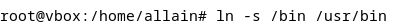

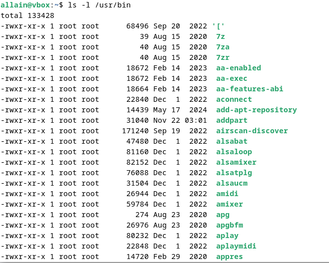

### File attributes
Dalam sistem berkas Unix dan Linux, setiap berkas memiliki sembilan bit izin (baca, tulis, eksekusi) ditambah tiga bit tambahan untuk operasi program, membentuk mode berkas. Mode ini disimpan bersama empat bit yang menentukan tipe berkas (tetap tidak berubah setelah dibuat), sedangkan pemilik atau superuser dapat mengubah 12 bit mode dengan perintah chmod.

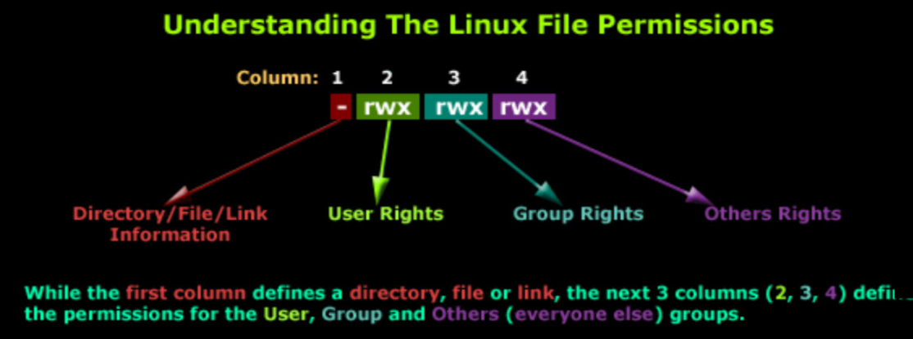

### Permission bits
Izin file terbagi menjadi tiga kelompok: untuk pemilik (u), grup (g), dan lainnya (o), yang bisa diingat dengan "Hugo". Notasi oktal juga digunakan karena setiap digit mewakili tiga bit: bit atas (400, 200, 100) untuk pemilik, tengah (40, 20, 10) untuk grup, dan bawah (4, 2, 1) untuk lainnya.

Pada file biasa, bit baca memungkinkan file dibaca, bit tulis memungkinkan modifikasi atau pemotongan file, namun penghapusan atau penggantian nama file diatur oleh izin direktori induk. Bit eksekusi memungkinkan file dijalankan. Ada dua jenis file eksekusi: biner (dijalankan langsung oleh CPU) dan skrip (memerlukan interpreter, biasanya ditandai dengan baris shebang).

```
#!/usr/bin/perl
```

File executable non-biner tanpa interpreter dianggap sebagai skrip sh. Kernel mengenali sintaks #! (shebang) dan menggunakannya untuk menentukan interpreter; jika tidak lengkap, kernel menolak file dan shell mencoba menjalankannya sebagai skrip.

Untuk direktori, bit eksekusi memungkinkan akses (melalui evaluasi pathname), namun hanya kombinasi bit baca dan eksekusi yang memungkinkan isi direktori ditampilkan. Kombinasi bit tulis dan eksekusi memungkinkan pembuatan, penghapusan, dan penggantian nama file di dalam direktori.

**The setuid and setgid bits**

Bit setuid (4000) dan setgid (2000) membuat kepemilikan file berubah sementara saat dieksekusi—setuid untuk pemilik dan setgid untuk grup. Pada direktori, setgid membuat file baru mewarisi grup direktori, sehingga memudahkan berbagi file.

**The sticky bit**

Bit dengan nilai oktal 1000 adalah sticky bit. Saat diset pada direktori, sticky bit mencegah pengguna menghapus atau mengganti nama file yang bukan miliknya—berguna untuk direktori bersama seperti /tmp.

**ls: list and inspect files**

Perintah ls menampilkan file dan direktori beserta atributnya. Dengan opsi -l, ls menunjukkan format panjang yang mencakup mode, jumlah hard link, pemilik, grup, ukuran, waktu modifikasi, dan nama file. Direktori selalu memiliki minimal dua hard link: '.' dan '..'. Contohnya:

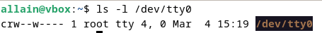

Huruf c di awal baris menunjukkan bahwa file tersebut adalah file perangkat karakter. Angka 4, 0 di akhir baris adalah nomor perangkat mayor dan minor.

**chmod: change permissions**

Perintah chmod mengubah mode dari sebuah file. Menggunakan notasi oktal atau notasi simbolik.

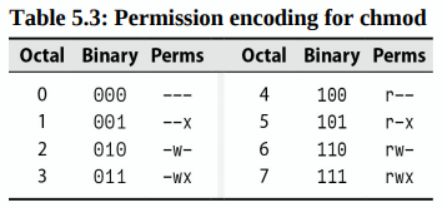

Contoh-contoh dari sintaks mnemonic chmod:

| Spesifikasi   | Arti                                                                                 |
|---------------|---------------------------------------------------------------------------------------|
| `u+w`         | Menambahkan izin tulis untuk pemilik berkas                                          |
| `ug=rw, o=r`  | Memberikan izin baca/tulis kepada pemilik dan grup, serta izin baca bagi yang lain   |
| `a-x`         | Menghapus izin eksekusi untuk semua pengguna                                         |
| `ug=srx, o=`  | Mengatur bit setuid, setgid, dan sticky untuk pemilik dan grup (izin baca/eksekusi)  |
| `g=u`         | Menyamakan izin grup dengan izin pemilik                                             |

**chown: change ownership**

Perintah chown mengubah pemilik dan grup sebuah berkas. Opsi -R menyebabkan chown mengubah kepemilikan isi berkas secara rekursif.
```
$ chown -R abdou:users /home/abdou
```
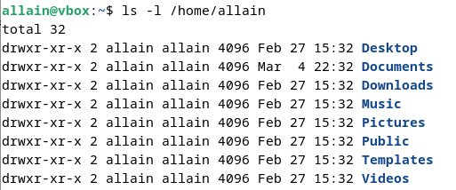

**chgrp: change group**

Perintah chgrp mengubah grup sebuah file. Opsi -R menyebabkan chgrp mengubah grup isi file secara rekursif.
```
$ chgrp -R users /home/abdou
```
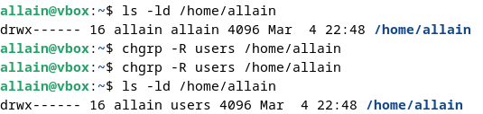

**umask: set default permissions**

Perintah umask menetapkan izin default untuk file dan direktori baru. Perintah umask adalah sebuah bit mask yang dikurangkan dari izin default untuk menentukan izin yang sebenarnya.

```
$ umask 022
```


| Oktal | Biner | Izin | Oktal | Biner | Izin |
|-------|-------|------|-------|-------|------|
| 0     | 000   | rwx  | 4     | 100   | -wx  |
| 1     | 001   | rw-  | 5     | 101   | -w-  |
| 2     | 010   | r-x  | 6     | 110   | --x  |
| 3     | 011   | r--  | 7     | 111   | ---  |

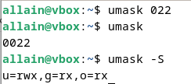

Sebagai contoh, umask 027 mengizinkan rwx untuk pemilik, rx untuk grup, dan tidak ada izin untuk orang lain.

### Access Control Lists
Model izin Unix tradisional sederhana namun memiliki keterbatasan, misalnya sulit memberikan beberapa pemilik pada satu file atau mengatur izin berbeda untuk sekelompok pengguna. Access Control Lists (ACLs) mengatasi masalah ini dengan memungkinkan file memiliki beberapa pemilik dan mengatur izin berbeda untuk tiap grup. Setiap aturan dalam ACL disebut Access Control Entry (ACE), yang terdiri dari penentu (nama pengguna, nama grup, atau kata kunci khusus seperti owner/other), mask izin, dan tipe (allow atau deny).

Perintah getfacl menampilkan ACL sebuah file, dan perintah setfacl menetapkan ACL sebuah file.
```
$ getfacl /etc/passwd
```
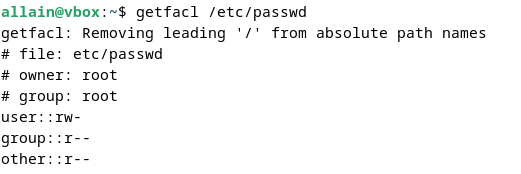
```
$ setfacl -m u:abdou:rw /etc/passwd
```
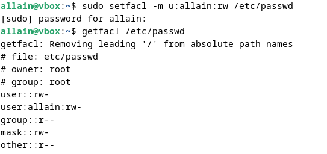

Ada dua jenis ACL: ACL POSIX dan ACL NFSv4. ACL POSIX adalah ACL Unix tradisional, dan ACL NFSv4 adalah jenis ACL yang lebih baru dan lebih kuat.

**Implementation of ACLs**

Secara teori, pengelolaan dan penegakan ACL bisa dilakukan oleh beberapa komponen sistem, misalnya oleh kernel untuk semua filesystem, oleh filesystem secara terpisah, atau oleh perangkat lunak tingkat atas seperti server NFS dan SMB.

**POSIX ACLs**

ACL POSIX adalah ACL Unix tradisional. ACL ini didukung oleh sebagian besar sistem operasi yang mirip Unix, termasuk Linux, FreeBSD, dan Solaris.

Entri yang dapat muncul di ACL POSIX
| Format                   | Contoh            | Mengatur izin untuk                   |
|--------------------------|-------------------|---------------------------------------|
| user::perms             | user::rw-         | Pemilik file                          |
| user:username:perms     | user:abdou:rw-    | Pengguna dengan nama username         |
| group::perms            | group::r-x        | Grup file                             |
| group:groupname:perms   | group:users:r-x   | Grup dengan nama groupname            |
| mask::perms             | mask::rwx         | Izin maksimum                         |
| other::perms            | other::r--        | Semua pengguna lainnya                |
Contoh:
```
$ setfacl -m user:abdou:rwx,group:users:rwx,other::r /home/abdou

$ getfacl --omit-header /home/abdou

user::rwx
user:abdou:rwx
group::r-x
group:users:r-x
mask::rwx
other::r--
```
**NFSv4 ACLs**

NFSv4 ACL adalah jenis ACL yang lebih baru dan lebih kuat, didukung oleh beberapa sistem operasi mirip Unix seperti Linux dan FreeBSD. NFSv4 ACL mirip dengan POSIX ACL tetapi memiliki fitur tambahan, misalnya default ACL yang digunakan untuk mengatur ACL pada file dan direktori baru.