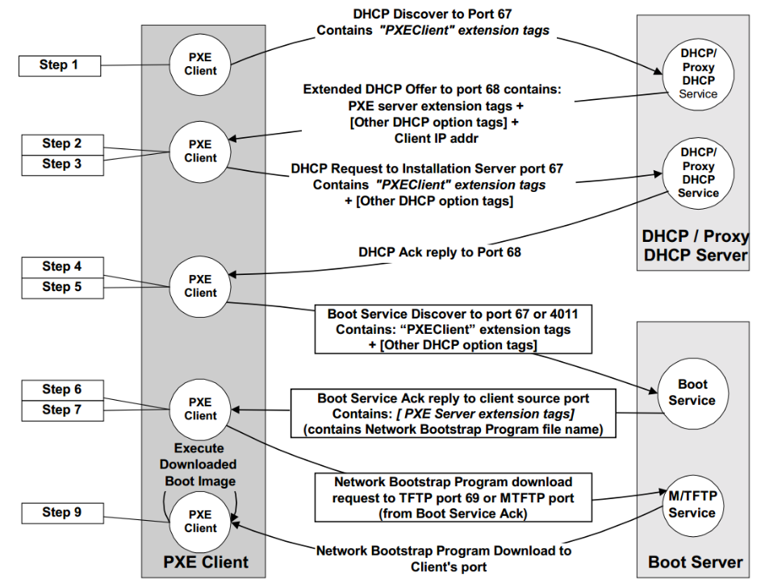

  <h1 style="text-align: center;font-weight: bold">LAPORAN RESMI WORKSHOP ADMINISTRASI JARINGAN</h1>

 

  
  <h4 style="text-align: center;">Dosen Pengampu : Dr. Ferry Astika Saputra, S.T., M.Sc.</h4>
  <h3 style="text-align: center;">Disusun Oleh : </h3>
  

    <strong>Nama : Achmad Risel Araby</strong> 
    <strong>Kelas : 2 D3 IT A</strong> 
    <strong>NRP : 3123500025</strong>
  

<h3 style="text-align: center;line-height: 1.5">Politeknik Elektronika Negeri Surabaya Departemen Teknik Informatika Dan Komputer Program Studi Teknik Informatika 2024/2025</h3>
  

## LAPORAN WORKSHOP 2.4: Chapter 6: Software Installation and Management

### Operating System Installation
Distro Linux dan FreeBSD memiliki langkah instalasi dasar yang mudah. Pada komputer fisik, Anda dapat melakukan boot dari CD, DVD, atau USB. Pada mesin virtual, Anda dapat melakukan boot dari berkas ISO. Berkat aplikasi antarmuka grafis, proses instalasi sistem operasi dasar menjadi cukup sederhana.

**Installation from the network**

Jika harus menginstal OS di beberapa komputer, cara menggunakan media lokal menjadi tidak efisien dan rawan kesalahan karena harus mengulangi langkah yang sama terus-menerus. Solusinya adalah menginstal OS melalui server jaringan, praktik umum di pusat data dan lingkungan cloud.

Metode yang umum digunakan adalah dengan DHCP dan TFTP untuk boot tanpa media fisik, lalu mengambil berkas instalasi OS dari server menggunakan HTTP, FTP, atau NFS. Berkas tersebut bisa berada di server yang sama atau berbeda.

Kita juga bisa mengatur instalasi otomatis sepenuhnya melalui PXE (Preboot eXecution Environment), sebuah standar dari Intel yang memungkinkan sistem boot dari jaringan. PXE berfungsi seperti OS mini yang terdapat di ROM pada kartu jaringan dan menyediakan API standar bagi BIOS, sehingga satu boot loader dapat melakukan netboot ke komputer manapun yang mendukung PXE tanpa perlu driver khusus untuk setiap kartu jaringan.

### Linux Package Management Systems
Ada dua format paket umum di Linux. Red Hat, CentOS, SUSE, Amazon Linux, dan distro lainnya menggunakan RPM, sedangkan Debian dan Ubuntu menggunakan .deb. Keduanya berfungsi serupa.

Masing-masing memiliki alat dasar untuk memasang, menghapus, dan memeriksa paket (rpm untuk RPM dan dpkg untuk .deb). Di atasnya, ada sistem yang bisa mencari, mengunduh, dan memperbarui paket secara otomatis, seperti yum untuk RPM dan APT yang awalnya untuk .deb namun juga mendukung RPM.

### High-Level Package Management
Alat manajemen paket tingkat tinggi sering digunakan untuk memasang, menghapus, dan memperbarui paket. Alat ini juga memungkinkan pencarian dan penampilan daftar paket yang terpasang.

**Package repositories**

Distributor Linux mengelola repositori perangkat lunak yang terintegrasi dengan sistem manajemen paket mereka. Konfigurasi default biasanya mengarah ke server web atau FTP yang dikelola oleh distributor.

- **Rilis:** Snapshot konsisten dari semua paket.
- **Komponen:** Bagian dari perangkat lunak dalam sebuah rilis.
- **Arsitektur:** Kelas perangkat keras yang serupa, sehingga dapat menjalankan biner yang sama (contoh: arsitektur i386 pada rilis Fedora 20).

**APT: Advanced Package Tool**

APT adalah kumpulan alat untuk mengelola paket Debian, sistem manajemen paket paling populer di sistem berbasis Debian. Alat-alatnya meliputi:

- **apt-get:** Menginstal, menghapus, dan memperbarui paket lewat baris perintah.
- **apt-cache:** Mencari dan menanyakan cache paket.
- **apt-file:** Mencari file di dalam paket.
- **apt-show-versions:** Menampilkan versi paket.
- **aptitude:** Antarmuka tingkat tinggi untuk manajemen paket, melakukan tugas apt-get dan lebih banyak lagi.
- **apt-mirror:** Membuat mirror repositori paket.

Di Ubuntu, abaikan dselect yang merupakan frontend untuk sistem paket Debian.

**yum: Yellowdog Updater, Modified**

Yum adalah manajer paket untuk sistem Linux berbasis RPM. Yum menangani dependensi saat menginstal, memperbarui, dan menghapus paket, serta mengelola paket melalui repositori dan baris perintah.

### Software localization and configuration
Menyesuaikan sistem dengan lingkungan lokal atau cloud adalah tantangan utama administrasi sistem. Mengatasi masalah lokalisasi secara terstruktur dan berulang mencegah munculnya sistem unik yang sulit dipulihkan setelah insiden besar.