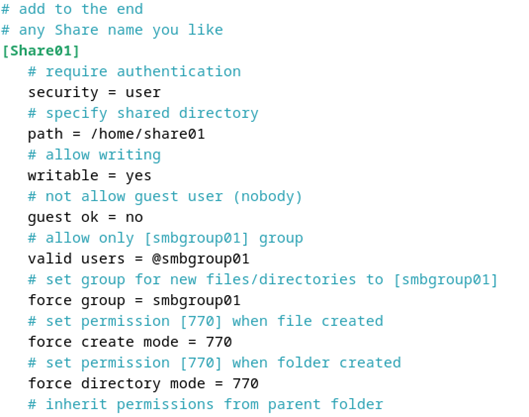
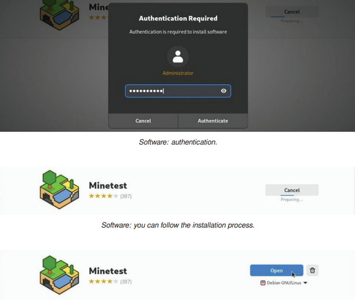
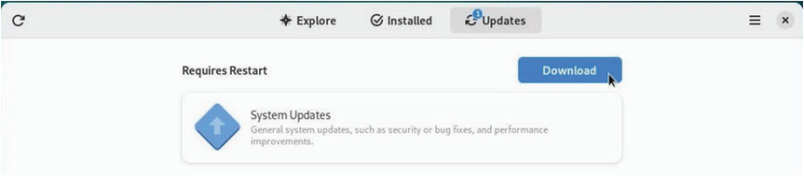
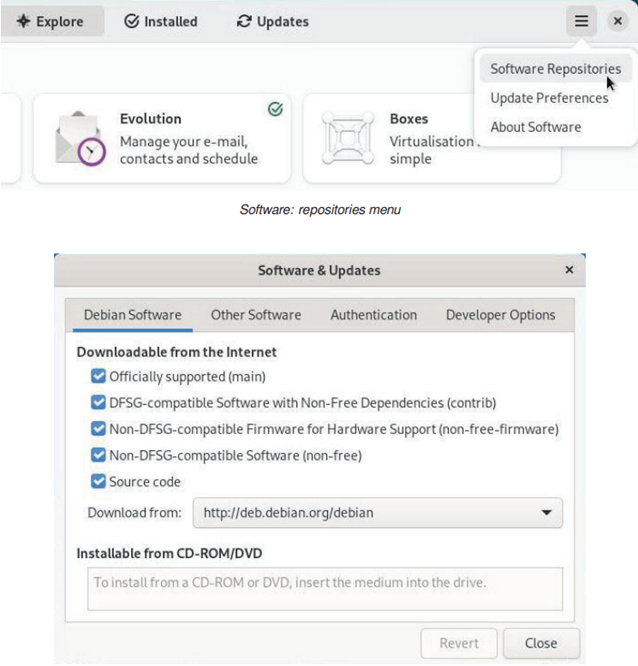
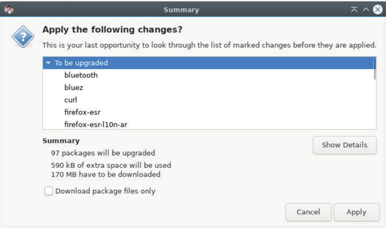

<div align="center">
  <h1 style="text-align: center;font-weight: bold">LAPORAN RESMI WORKSHOP<br>ADMINISTRASI JARINGAN</h1>
</div>
<br />
<div align="center">
  
  <h4 style="text-align: center;">Dosen Pengampu : Dr. Ferry Astika Saputra, S.T., M.Sc.</h4>
  <h3 style="text-align: center;">Disusun Oleh : </h3>
  <p style="text-align: center;">
    <strong>Nama : Achmad Risel Araby</strong><br>
    <strong>Kelas : 2 D3 IT A</strong><br>
    <strong>NRP : 3123500025</strong>
  </p>

<h3 style="text-align: center;line-height: 1.5">Politeknik Elektronika Negeri Surabaya<br>Departemen Teknik Informatika Dan Komputer<br>Program Studi Teknik Informatika<br>2024/2025</h3>
  <hr><hr>
</div>

## LAPORAN WORKSHOP 3: 

### A. Instalasi NTP Client
1. Install dan konfigurasi NTP client agar host anda mempunyai Waktu yang sinkron dengan NTP server di Indonesia.

    Install ntpsec terlebih dahulu:
    

    Cek date saat ini berdasarkan lokasi saya:
    

2. Atur NTP server.

    Ubah konfigurasi NTP server sesuai zona, disini kita menggunakan zona id Indonesia dari link https://www.ntppool.org/en/zone/id:
    

    Selanjutnya restart menggunakan “systemctl restrart ntpsec” dan verifikasi status seperti berikut:
    

### B. Instalasi dan Konfigurasi Samba
1. Membuat public shared folder.

    Install samba terlebih dahulu:
    

    Lakukan konfigurasi pada /etc/samba/smb.conf seperti berikut:
    - unix charset = UTF-8, menetapkan charset ke UTF-8, sehingga karakter khusus dapat ditampilkan dengan benar dan kompatibel antara sistem Linux dan Windows.
    - interfaces = 127.0.0.0/8 10.0.0.0/24, 127.0.0.0/8 adalah loopback (localhost) dan 10.0.0.0/24 adalah jaringan lokal yang diizinkan mengakses share.
    - map to guest = bad user, mengarahkan pengguna yang gagal melakukan otentikasi untuk masuk sebagai guest.

    
    Tambahkan definisi share:
    - path = /home/share, menentukan path direktori yang akan dibagikan.
    - writable = yes, mengizinkan pengguna untuk menulis (upload, mengubah, menghapus file) dalam share.
    - guest ok = yes, mengizinkan akses tanpa autentikasi sehingga pengguna guest dapat mengakses share.
    - guest only = yes, menegaskan bahwa hanya pengguna guest yang dapat mengakses share, memastikan semua koneksi tidak memerlukan akun pengguna.
    - force create mode = 777, memaksa file yang dibuat di dalam share untuk memiliki permission 777, memastikan file dapat diakses secara penuh.
    - force directory mode = 777, memaksa direktori yang dibuat dalam share untuk memiliki permission 777, agar direktori baru juga dapat diakses secara penuh.

    
    Akses melalui Windows client:
    
    Akses melalui Debian client:
    

2. Membuat limited shared Folder.

    Buat grup baru smbgroup01, buat direktori share01, ubah kepemilikan folder share01 menjadi smbgroup01, berikan izin penuh (read, write, execute) kepada pemilik dan grup. Izin 770 memastikan keamanan dengan membatasi akses ke anggota grup yang telah ditentukan:
    
    Lakukan konfigurasi pada /etc/samba/smb.conf seperti berikut:
    - unix charset = UTF-8, menetapkan charset ke UTF-8, sehingga karakter khusus dapat ditampilkan dengan benar dan kompatibel antara sistem Linux dan Windows.
    - interfaces = 127.0.0.0/8 10.0.0.0/24, 127.0.0.0/8 adalah loopback (localhost) dan 10.0.0.0/24 adalah jaringan lokal yang diizinkan mengakses share.
    
    Tambahkan definisi share:
    - security = user, m engharuskan autentikasi pengguna.
    - path = /home/share01, menunjuk ke direktori yang akan dibagikan
    - writable = yes, emungkinkan operasi tulis (menambah, mengubah, atau menghapus file) dalam share.
    - guest ok = no, melarang akses tanpa autentikasi.
    - valid users = @smbgroup01, h anya pengguna yang merupakan anggota dari grup smbgroup01 yang diizinkan mengakses share. Tanda @ menunjukkan bahwa parameter tersebut mengacu pada grup, bukan user individu.
    - force group = smbgroup01, memastikan bahwa setiap file atau folder yang dibuat melalui share akan secara otomatis memiliki grup smbgroup01 sebagai grup kepemilikannya, menjaga konsistensi hak akses.
    - force create mode = 770, mengatur agar file baru dan direktori baru yang dibuat di dalam share memiliki izin 770.
    - force directory mode = 770, memastikan bahwa hanya pemilik dan anggota grup yang dapat membaca, menulis, dan mengeksekusi file atau direktori tersebut.
    - inherit permissions = yes, menginstruksikan agar file dan direktori yang dibuat di dalam share mewarisi izin dari direktori induknya.

    
    Tambahkan user baru dernama debian:
    
    Login dengan user yang telah ditentukan:
    
    Setelah itu maka direktori Share01 akan muncul:
    

3. Akses ke folder Share dari CLI client.

    Menambahkan sebuah file di direktori Share01:
    
    Akses file yang ada pada direktori Share01 melalui CLI:
    

### C. Buat rangkuman tentang package management.

1. Sumber-Sumber Perangkat Lunak

    Debian GNU/Linux menggunakan metode repositori untuk mendistribusikan aplikasi, memungkinkan sentralisasi perangkat lunak dan penggunaan antarmuka sederhana untuk mengelola dan memperbarui sistem. Pengguna tidak perlu mengunjungi situs web perangkat lunak secara langsung.

    **1.1 The sources.list file**

    Alamat internet dari repositori Debian disimpan dalam berkas /etc/apt/sources.list, serta berkas-berkas dengan tipe /etc/apt/sources.list.d/xxx.list.

    Untuk mengedit dan memodifikasi berkas sources.list dapat menggunakan salah satu perintah berikut (dalam mode administrator):
    
    

    Keterangan mengenai berbagai informasi yang ditemukan dalam file 'sources list':
    - "deb": berarti repositori biner.
    - "deb-src": berarti repositori sumber.
    - "http..." atau "https...": alamat Internet dari server repositori.
    - "bookworm" atau "bookworm-security": cabang dalam repositori gratis.
    - "main" atau "non-free-firmware": bagian repositori.

    Mengapa "bookworm" dan bukan "stable" karena sistem berbasis pada Debian Stable ??

    "bookworm" adalah nama versi yang dari sistem yang terinstal. Ini menentukan versi setiap paket yang termasuk dalam repositori "bookworm". Saat ini, Debian 12 "bookworm" adalah versi "stable", jadi bisa menggunakan kedua penamaan tersebut. Tetapi ketika versi Debian "stable" menjadi Debian 13 "Trixie", maka atribut Debian 12 "bookworm" akan berubah menjadi "oldstable".

    **1.2 Tentang cabang dan bagian/komponen repositori**

    Debian mengatur paket perangkat lunaknya dalam repositori yang dibagi menjadi cabang dan bagian/komponen. Ada empat bagian dalam repositori Debian resmi:
    - main: Mematuhi DFSG tanpa dependensi "non-free".
    - non-free-firmware: Firmware non-free yang termasuk secara default sejak Debian 12.
    - contrib: Mematuhi DFSG dengan beberapa dependensi "non-free".
    - non-free: Tidak mematuhi DFSG.

    DFSG (Debian Free Software Guidelines) adalah prinsip-prinsip filosofis dari perangkat lunak bebas Debian. Hanya paket dalam bagian main yang secara resmi didukung oleh proyek Debian dan 100% perangkat lunak bebas. Paket dalam contrib, non-free, dan non-free-firmware sebagian atau seluruhnya non-free.

    Beberapa layanan mungkin tidak berfungsi dengan benar tanpa penggunaan driver tertentu (proprietary). Dalam hal ini, perlu menyesuaikan file /etc/apt/sources.list.

    **1.3. Paket Backport**

    Debian menawarkan repositori khusus yang disebut "backports", yang berisi versi lebih baru dari beberapa aplikasi. Repositori ini tidak diaktifkan secara default dan tidak berisiko untuk sistem. Repositori "regular" memiliki prioritas tertinggi selama proses pembaruan, dan hanya aplikasi yang diinstal dari backports yang akan mengacu pada repositori ini.

    Backports adalah mekanisme yang memungkinkan aplikasi yang saat ini berada di repositori pengembangan Debian untuk dipindahkan kembali ke versi "stabil". Misalnya, pengembang Debian mengambil versi terbaru dari LibreOffice dari repositori pengembangan dan mengkompilasi ulang paket tersebut sambil mempertahankan semua dependensi yang ada di versi "stabil".

    **1.4. Memodifikasi Repositori**

    Sebelum memodifikasi sumber perangkat lunak sistem, penting untuk memahami risiko penggunaan komponen "contrib" atau "non-free" dari cabang arsip:
    - Kurangnya kebebasan untuk jenis paket ini.
    - Kurangnya dukungan dari proyek Debian.
    - Kontaminasi sistem Debian yang sepenuhnya bebas.

    Setelah memahami risiko, untuk memodifikasi sumber perangkat lunak, edit file sources.list. Buka terminal dalam mode administrator dan masukkan:
    
    Perintah ini membuka file yang sesuai dengan editor teks default (nano atau vim).
    
    Contoh entri baris untuk paket gratis:

    deb http://deb.debian.org/debian/ bookworm main

    Contoh entri baris untuk paket gratis dan proprietary:

    deb http://deb.debian.org/debian/ bookworm main contrib non-free non-free-firmware

    Sekarang Anda dapat memilih dari 4 bagian paket dan menginstal kode dan driver non-free. Anda juga dapat memodifikasi sumber perangkat lunak menggunakan manajer paket Synaptic grafis.

2. APT in a Terminal

    Bagian ini menjelaskan perintah dasar untuk mengelola paket Debian menggunakan APT (Advanced Package Tool) melalui terminal emulator. Debian juga mendukung "aptitude", manajer paket lain dengan sintaks dan perilaku yang berbeda, namun manual ini tidak membahasnya secara rinci karena ditujukan untuk pemula. Untuk informasi lebih lanjut tentang aptitude, kunjungi wiki Debian Aptitude di https://wiki.debian.org/Aptitude .

    **2.1 Perintah 'Pengguna' untuk Mencari dan Menampilkan Informasi**

    Perintah ini dapat dieksekusi oleh pengguna biasa karena tidak mempengaruhi system:
    - apt show foo: Menampilkan informasi tentang paket foo.
    - apt search foo: Mencari paket yang sesuai dengan foo.
    - apt-cache policy foo: Menampilkan versi paket foo yang tersedia.

    **2.2 Perintah 'Administrator' untuk Pemeliharaan Sistem**

    Perintah ini harus dieksekusi dengan hak akses administrator (su -) karena mempengaruhi sistem:
    - apt update: Memperbarui metadata repositori.
    - apt install foo: Menginstal paket foo dan dependensinya.
    - apt upgrade: Memperbarui paket yang terinstal secara aman.
    - apt full-upgrade: Memperbarui paket yang terinstal, menambahkan atau menghapus paket jika diperlukan.
    - apt remove foo: Menghapus paket foo, tetapi tidak menghapus berkas konfigurasi.
    - apt autoremove: Menghapus paket yang tidak diperlukan secara otomatis.
    - apt purge foo: Menghapus paket foo dan berkas konfigurasinya.
    - apt clean: Membersihkan cache lokal paket yang terinstal.
    - apt autoclean: Membersihkan cache lokal paket yang using.
    - apt-mark showmanual: Menandai paket sebagai "dipasang secara manual".

    Perintah Satu-Satu (All-in-One)
    - apt update && apt full-upgrade && apt autoclean: Memperbarui informasi repositori, memperbarui sistem, dan membersihkan cache paket.
    - apt autoremove --purge: Menghapus paket yang tidak digunakan, dependensi yang tidak diperlukan, dan berkas konfigurasi lama.

3. Software: Manajer Paket yang Disederhanakan

    Software adalah manajer paket yang disederhanakan untuk aplikasi Debian. Alat ini memungkinkan Anda untuk mencari, menginstal, menghapus, atau memperbarui paket yang berisi aplikasi Anda. Anda dapat menemukannya di kategori "Sistem" dalam menu atau langsung dari kotak pencarian Gnome dengan mengetik "Software".
    

    **3.1. Perangkat Lunak: Mencari Aplikasi**

    Langsung dengan mengklik tombol pencarian atau dengan memilih salah satu dari kategori yang ditampilkan:
    

    **3.2. Perangkat Lunak: Menginstal Aplikasi**

    Anda dapat menginstal aplikasi hanya dengan mengklik area deskripsi aplikasi tersebut dan kemudian menekan tombol "Instal". Kata sandi administrator akan diminta. Anda dapat mengikuti perkembangan instalasi di jendela utama dan kemudian menjalankan langsung aplikasi yang baru saja diunduh.
    
    

    **3.3. Perangkat Lunak: Menghapus Aplikasi**

    Anda dapat menghapus aplikasi dengan mengunjungi kategori "Terinstal" (di bagian atas antarmuka) dan kemudian mengklik tombol "Hapus". Anda akan diminta untuk konfirmasi:
    

    **3.4. Perangkat Lunak: Memperbarui Aplikasi Anda**

    Anda dapat memperbarui sistem dari bagian khusus "Pembaruan" yang akan menunjukkan pembaruan yang tersedia dan/atau sudah diunduh. Jika tidak ada pembaruan yang tersedia, Anda dapat memeriksa repositori dengan menggunakan tombol khusus di pojok kiri atas.

    Dalam contoh kami, satu set pembaruan termasuk "pembaruan sistem operasi" memerlukan restart. Kita mulai dengan mengunduh paket untuk diperbarui:
    
    Setelah itu, restart dan update:
    

    **3.5. Perangkat Lunak: Mengubah Repositori Paket**

    Aplikasi "Perangkat Lunak" memungkinkan pengaturan repositori paket secara visual melalui opsi "Repositori" di menu. Anda bisa menambahkan sumber "non-free" atau atur frekuensi pembaruan, dengan informasi alamat repositori berasal dari berkas sources.list.
    
    

    **3.6. Pembaruan Otomatis dengan Perangkat Lunak**

    Aktifkan pembaruan otomatis melalui menu "Perangkat Lunak" untuk memastikan sistem tetap terbaru tanpa perlu khawatir. Pilihan di "Preferensi Pembaruan" mudah dipahami.
    
    

4. Discover: Manajer Paket KDE

    KDE menggunakan Discover sebagai manajer paket yang intuitif dan efisien. Discover menyediakan fitur pencarian, instalasi, penghapusan, dan pembaruan aplikasi dalam satu antarmuka, serta opsi untuk mengubah sumber perangkat lunak. Akses Discover melalui menu utama KDE di bagian Pusat Perangkat Lunak.
    

    **4.1. Mencari dan Menginstal dengan Discover**

    Untuk menemukan aplikasi, ketikkan namanya di bidang pencarian khusus atau kunjungi berbagai kategori dalam Discover. Kemudian cukup klik tombol "Instal":
    
    
    Anda akan diminta konfirmasi untuk setiap tindakan pada perangkat lunak beserta kata sandi administrator. Proses kemudian akan berjalan di latar belakang. Anda dapat mengikuti perkembangan modifikasi dalam area notifikasi KDE.

    **4.1.1. Menginstal Widget dan Addon Desktop Plasma**

    Discover memungkinkan Anda menambahkan komponen tambahan ke lingkungan Plasma Anda. Untuk melakukan ini, kunjungi bagian "Plasma add-ons".
    

    **4.2. Menghapus Aplikasi dengan Discover**

    Dengan Discover, cukup kunjungi kategori "Terinstal" lalu klik "Hapus":
    

    **4.3. Discover: Memperbarui Aplikasi Anda**

    Ketika KDE memberi tahu Anda tentang satu atau lebih pembaruan, itu adalah "Discover" yang melakukan pembaruan tersebut. Untuk memeriksa pembaruan "manual", klik tombol yang ditujukan:
    
    Ketika KDE memberi tahu Anda tentang satu atau lebih pembaruan, "Discover" yang akan melakukan pembaruan tersebut. Untuk memeriksa pembaruan secara "manual", klik tombol yang ditujukan:

    

    Cukup klik pada "Perbarui Semua" dan konfirmasikan dengan kata sandi administrator.
    
    
    
    Sama seperti pengelolaan perangkat lunak, Anda dapat mengikuti proses dalam area notifikasi KDE. Dan pesan akan memberi tahu Anda di akhir proses.

    **4.4. Discover: Mengelola Repositori**

    Perpustakaan perangkat lunak KDE memungkinkan Anda untuk mengubah sumber aplikasi Anda tanpa menggunakan terminal. Buka bagian "Pengaturan" dari Discover, entri menampilkan alamat repositori dari sources.list Anda.
    

5. Synaptic: Manajer Paket Lengkap

    Synaptic adalah manajer paket Debian dengan antarmuka grafis yang lengkap, menampilkan semua paket termasuk perpustakaan. Fungsinya mirip dengan apt, membutuhkan kata sandi admin untuk akses, dan koneksi internet untuk instalasi atau pembaruan.

    **5.1. Synaptic: Antarmuka Utama**

    
    Antarmuka utama Synaptic terdiri dari empat area: bilah alat, panel kiri untuk pengurutan dan pemilihan paket, panel tengah untuk daftar paket, dan panel bawah untuk deskripsi paket yang dipilih. Kotak status menunjukkan status paket, dan logo Debian menandakan paket bebas. Jelajahi menu untuk mengenal fitur-fiturnya, dan pastikan untuk mengklik "Muat Ulang" saat pertama kali membuka Synaptic untuk memperbarui informasi.
    

    **5.2. Mengelola Repositori dengan Synaptic**

    Repositori memungkinkan Anda untuk memperbarui dan menginstal paket tambahan. Buka manajer paket Synaptic (menu Sistem > Manajer Paket Synaptic). Di bilah menu atas, klik "Pengaturan", lalu "Repositori".
    
    
    Daftar repositori dalam Synaptic sesuai dengan isi berkas /etc/apt/sources.list. Anda dapat memodifikasi atau menambahkan sumber repositori dengan mengklik pada sumber yang ada atau tombol "Baru". Setelah perubahan diverifikasi, muat ulang daftar repositori untuk menerapkan perubahan. Untuk antarmuka yang lebih sederhana di desktop Xfce, LXDE, atau LXQt, instal paket "software-properties-gtk".
    

    **5.3. Memperbarui Sistem dengan Synaptic**

    Sebelum memperbarui sistem, perlu untuk "Muat Ulang" daftar paket dengan mengklik tombol yang sesuai, atau melalui menu "Edit > Muat Ulang Informasi Paket" (atau tekan [Ctrl]+r jika ingin menggunakan pintasan keyboard). Tindakan ini memeriksa apakah versi paket yang ada di sistem Anda adalah yang terbaru.
    
    Setelah memuat ulang daftar paket, klik "Tandai Semua Pembaruan" atau pilih menu "Edit > Tandai Semua Pembaruan". Jika tidak ada perubahan setelah "Perbarui Semua", sistem sudah terbaru dan Synaptic dapat ditutup. Untuk melihat paket yang bisa diperbarui, cek bagian "Status" > "terinstal (dapat diperbarui)".
    
    Muncul jendela baru dengan daftar paket yang akan diperbarui serta ketergantungan tambahan, jika ada yang diperlukan:
    
    Klik "Tambahkan ke Pilihan" lalu tombol "Terapkan", dan terima konfirmasi yang diminta:
    
    
    Proses pembaruan sistem dimulai dengan mengunduh paket-paket, dan dilanjutkan dengan instalasinya.
    
    Pesan akan memberi tahu Anda bahwa semua perubahan telah diterapkan.
    

    **5.5.1. Menginstal Ulang Paket**

    Kadang kita ingin menginstal ulang paket yang sudah terinstal. Dalam hal ini, pilih opsi "Tandai untuk Penginstalan Ulang". Ini memungkinkan, misalnya, untuk memulihkan konfigurasi default aplikasi jika Anda telah mengubahnya.

    **5.6. Menghapus Paket dengan Synaptic**

    Untuk menghapus paket, klik kanan pada kotak di depan nama paket dan pilih "Tandai untuk Penghapusan", lalu klik "Terapkan". Ini akan menyimpan file konfigurasi jika Anda ingin menginstalnya kembali. Untuk menghapus file konfigurasi juga, pilih "Tandai untuk Penghapusan Lengkap" (setara dengan "purge" dalam terminal).
    
    
    **5.6.1. Synaptic: Membersihkan Paket yang Tidak Berguna**

    Setelah menghapus perangkat lunak, beberapa paket ketergantungan yang tidak lagi berguna mungkin masih ada di sistem. Paket-paket ini dapat dengan mudah dihapus menggunakan Synaptic. Ketika Synaptic diluncurkan, klik tombol "Status" di bagian bawah panel kiri dan pilih kategori "Terinstal (Dapat Dihapus Otomatis)" untuk menampilkan dan menghapus paket-paket tersebut.
    
    Selanjutnya yang perlu Anda lakukan adalah klik kanan pada setiap paket di panel tengah, dan pilih opsi "Tandai untuk Penghapusan Lengkap". Setelah semua paket ditandai, klik tombol "Terapkan".

    **5.6.2. Menghapus Sisa Konfigurasi**

    Meskipun perangkat lunak telah dihapus sepenuhnya, sisa konfigurasi mungkin masih ada. Anda dapat menghapusnya dengan Synaptic. Klik tombol "Status" di panel kiri bawah, pilih kategori "Tidak Terinstal (konfigurasi residu)" jika tersedia. Kemudian, klik kanan pada setiap paket di panel tengah, pilih "Tandai untuk Penghapusan Lengkap", dan terakhir klik "Terapkan".
    

    **5.7. Melihat Informasi Rinci pada Paket**

    Dengan mengklik paket, deskripsinya akan muncul di panel tengah bawah Synaptic. Untuk informasi lebih lanjut, klik kanan pada paket dan pilih "Properti" atau menu "Paket > Properti". Anda akan mendapatkan detail lengkap tentang paket tersebut, termasuk ketergantungan, file terinstal, ukuran, dan versi.

    **5.8. Preferensi Synaptic**

    "Preferensi" adalah kategori umum yang ada di banyak aplikasi, termasuk Synaptic. Namun, Synaptic memiliki fungsi khusus karena mengelola semua perangkat lunak terinstal di sistem Anda. Jika Anda menghapus program melalui Synaptic, ia tidak akan masuk ke keranjang sampah dan tidak dapat dipulihkan seperti biasanya.

    Setelah memahami hal ini, mari kita lihat pengaturan Synaptic. Jendela Preferensi, yang dapat diakses melalui menu "Pengaturan > Preferensi", menampilkan 6 tab berbeda untuk berbagai opsi konfigurasi.
    
    Pengaturan umum Synaptic meliputi opsi yang jelas, penyesuaian kolom dan font, penentuan warna berdasarkan status, manajemen file cache, konfigurasi jaringan, dan perilaku pembaruan distribusi. Beberapa opsi seperti mengabaikan paket yang direkomendasikan harus ditangani dengan hati-hati karena bisa mempengaruhi instalasi paket di masa depan.

6. Membersihkan Sistem

    Meski kapasitas hard disk telah bertambah secara dramatis dalam beberapa tahun terakhir, mungkin Anda masih membutuhkan ruang bebas. Beberapa skrip dapat mengotomatisasi proses pembersihan disk, namun saya lebih suka memeriksa sebelum menggunakan perintah rm (berdiri untuk remove, bab 11.2).

    **6.1. Informasi Ruang Disk**

    Langkah pertama yang harus dilakukan adalah mengetahui ruang yang digunakan di disk Anda. Berbagai alat tersedia untuk Anda, dimulai dari terminal:

    - Ruang Disk dalam Mode Terminal:

      Ringkasan penggunaan ruang disk untuk setiap titik mount sistem (disk dan partisi) dengan perintah df:
      

    - Daftar Repositori Berdasarkan Ukuran yang Menurun:

      Lihat direktori Anda secara massal dengan du dan sort (satuan dalam megabyte):
      
      Ini akan menampilkan direktori terbesar hingga yang terkecil berdasarkan ukuran.

    - NCDU:

      Sebuah analisis ruang disk dalam mode konsol. Untuk menjalankannya, cukup ketik "ncdu" di terminal Anda. Untuk menginstal perangkat lunak ini (dalam mode administrator):
      

    - Baobab:
      
      Sebuah analisis ruang disk dalam mode grafis, terintegrasi dalam Gnome tetapi tersedia di lingkungan lain dengan:
      
      
    
    **6.2. Membersihkan Paket**

    Apt/aptitude/dpkg adalah manajer paket Debian yang umum. Ketika Anda menginstal paket, file sumber arsipnya (file .deb) disimpan di sistem Anda (dalam folder /var/cache/apt/archives/) untuk memungkinkan pemasangan ulang tanpa koneksi internet. Untuk membersihkan "apt cache," gunakan perintah sederhana ini dalam mode administrator (bab 3.8.3):

    

    Setelah cache paket yang diinstal dibersihkan, Anda juga dapat menghapus paket yang tidak digunakan dari sistem Anda, termasuk file konfigurasi. Peringatan! Periksa dengan teliti daftar paket yang akan dihapus sebelum menyetujui operasi:
    
    Jika Anda telah memperbarui sistem, beberapa paket mungkin tidak tersedia lagi di repositori baru; mereka usang. Untuk mendaftar dan menghapus paket-paket ini, gunakan apt dan periksa dengan teliti daftar paket yang akan dihapus:
    
    Akhirnya, untuk mendaftar dan membersihkan file konfigurasi yang tetap ada meskipun aplikasi dihapus, gunakan perintah berikut:
    
    Untuk manajemen yang lebih mendalam, Anda dapat menginstal alat deborphan yang mendaftar paket yang ditinggalkan di sistem Anda—paket yang tidak ada paket lain yang bergantung padanya. Peringatan! Periksa dengan teliti daftar paket yang akan dihapus sebelum menyetujui operasi:
    
    

    **6.3. Mengosongkan Tempat Sampah**

    Terdapat tiga tempat sampah (atau keranjang sampah) yang perlu diperhatikan:

    - Keranjang sampah pengguna: ~/local/share/Trash/. Anda dapat mengosongkannya dengan manajer file sistem (bab 3.6.2.5) atau dengan terminal:
    
    - Keranjang sampah administrator: /root/local/share/Trash/. Untuk mengosongkannya dengan benar, gunakan terminal dalam mode administrator:
    
    - Keranjang sampah eksternal: Biasanya terletak di disk eksternal, dengan nama seperti /media/your_id/your_disk/Trash_1000, di mana your_id adalah nama pengguna Anda.

    **6.4. Membersihkan Cache Aplikasi**

    Beberapa aplikasi menggunakan folder "cache" untuk menyimpan gambar, video, dan informasi lainnya agar dapat berjalan lebih cepat. Data ini biasanya tidak memakan banyak ruang disk, tetapi jika folder tersebut terlalu besar, jangan ragu untuk menghapusnya:
    
    Setiap aplikasi memiliki cara sendiri untuk mengelola cache: beberapa aplikasi membersihkannya secara otomatis saat ditutup, yang lainnya menyimpannya di folder /tmp yang akan dibersihkan saat logout, dan yang lainnya menyimpannya di folder spesifik.

    Misalnya, untuk Firefox, Anda dapat membersihkan cache dari menu preferensi dan bahkan mengatur agar ini terjadi secara otomatis setiap kali aplikasi ditutup.

    **6.5. Membersihkan Thumbnail**

    Setiap kali Anda membuka folder yang berisi gambar atau video, thumbnail dibuat untuk mewakili file grafis ini. Thumbnail disimpan di folder tertentu agar tidak perlu dihitung ulang setiap kali Anda mengakses jenis file ini.

    Masalah timbul ketika Anda menghapus file grafis, karena thumbnailnya tetap ada di sistem, membuang ruang disk untuk thumbnail yang tidak digunakan. Untuk menghapusnya, cukup hapus folder yang sesuai:

    

    Folder ini akan dibuat kembali saat sistem perlu menyimpan thumbnail baru.

7. Menginstal Paket Eksternal ".deb"

    Debian GNU/Linux menggunakan sistem repositori paket untuk mengelola perangkat lunak dan meningkatkan keamanan sistem. Namun, mungkin Anda perlu menginstal paket eksternal dalam format ".deb".

    .deb adalah singkatan dari "Debian," perusahaan induk yang mendistribusikan perangkat lunaknya dalam format arsip khusus ".deb". Ini adalah format terkompresi seperti "zip" yang digunakan untuk menyimpan data. Paket ".deb" ini dikenali oleh berbagai manajer paket Debian (APT dan antarmuka grafisnya, Synaptic) dan dapat diatur lebih mudah.

    **7.1. Instalasi dalam Mode Grafis dengan GDebi**

    GDebi adalah utilitas grafis yang memungkinkan pemasangan paket eksternal dalam format ".deb", sambil mengelola dependensinya.
    
    Untuk menginstalnya, cari "gdebi" di manajer paket favorit Anda (Synaptic, Discover, Software) atau instal langsung dari terminal dalam mode administrator menggunakan su (bab 3.8.3):

    

    Ketika Anda mengunduh paket eksternal Debian, klik kanan pada file tersebut dan pilih "Buka dengan gdebi".
    
    Dalam menu, klik pada "File > Buka" dan masukkan jalur file ".deb":
    
    Kemudian klik pada "Install Package". Kata sandi Anda diminta untuk memvalidasi instalasi.
    
    
    Untuk menghapusnya, sangat mudah: cukup klik pada "Remove Package".
    
    
    **7.2. Instalasi dalam mode terminal dengan Dpkg**

    Dpkg adalah utilitas perangkat lunak yang mengelola paket, mirip dengan apt, tetapi tanpa mengelola dependensi. Ini berarti jika Anda menggunakan dpkg untuk menginstal paket eksternal, Anda perlu menginstal paket "dependensi" satu per satu dari terminal Anda. Dpkg terintegrasi secara default di Debian dan harus digunakan dalam mode administratif.

    Untuk menginstal paket eksternal:

    Pesan error akan memberi tahu Anda jika ada dependensi yang hilang. Kemudian, instal dependensi tersebut secara klasik dengan apt:
    
    Pesan error akan memberi tahu Anda jika ada dependensi yang hilang. Kemudian, instal dependensi tersebut secara klasik dengan apt:
    
    Kemudian, jalankan kembali instalasi paket eksternal Anda:
    
    Untuk menghapus paket eksternal:
    

8. Menginstal Aplikasi Flatpak

    Flatpak (https://docs.flatpak.org/en/latest/getting-started.html) adalah sistem aplikasi virtualisasi untuk distribusi GNU/Linux. Tujuannya adalah untuk menyediakan lingkungan "sandbox" yang aman, terisolasi dari sistem lainnya, di mana pengguna dapat menjalankan aplikasi yang tidak divalidasi oleh repositori distribusi (misalnya, versi tes).

    Format Flatpak berfungsi secara berbeda: aplikasi dikompres bersama semua dependensinya, sehingga menjadi sepenuhnya independen dari sistem di mana ia dipasang. Jadi, di sini Anda dapat menginstal dan menggunakan aplikasi yang baru diperbarui atau bahkan yang baru, dibandingkan dengan repositori Debian.

    Keuntungan Flatpak:
    - Sandbox adalah kotak keamanan di mana aplikasi berjalan tanpa akses ke sisa sistem (dengan pengecualian jika pengguna memberikan otorisasi), sehingga mencegah perangkat lunak berbahaya menyebar ke sistem Anda.
    
    - Menjalankan beberapa versi: Ini memungkinkan Anda untuk menjalankan beberapa versi dari aplikasi yang sama, yang sangat berguna untuk aplikasi seperti Minetest dan server dalam versi yang berbeda.

    Kelemahan:
    Format ini tidak diverifikasi oleh keamanan Debian. Ketika menginstal flatpaks, lebih baik menggunakan aplikasi referensi yang dipercaya (seperti Gimp, VLC, Blender, dll.).

    **8.1. Menginstal Flatpak**

    Untuk memanfaatkan aplikasi dalam format Flatpak, Anda harus terlebih dahulu menginstal paket yang sesuai. Dari terminal dalam mode administrator, jalankan:
    
    Setelah itu, Anda dapat mengunduh dan menginstal paket Flatpak dengan mengunjungi salah satu situs web yang mengumpulkan aplikasi ini, seperti Flathub (https://flathub.org/home). Namun, cara tercepat adalah dengan menambahkan repositori ke sumber Anda untuk mendapatkan daftar aplikasi lengkap tanpa perlu mencari di situs web.

    **8.2. Menambahkan Repositori Flatpak**

    Untuk menambahkan repositori seperti Flathub, jalankan perintah berikut di terminal:

    flatpak remote-add flathub https://flathub.org/repo/flathub.flatpakrepo
    
    Anda akan diminta untuk kata sandi administrator, dan perubahan akan berlaku setelah Anda memulai ulang sistem.
    

    **8.3. Mengelola Aplikasi Flatpak di GNOME dengan Perangkat Lunak**

    Untuk mengelola Flatpak melalui manajer perangkat lunak Anda, tambahkan plugin yang sesuai dengan lingkungan Anda. Untuk GNOME dan manajer perangkat lunak sederhananya, di terminal dan dalam mode administrator, jalankan:
    
    Sekarang, Anda dapat mengelola Flatpak Anda seperti aplikasi lainnya.
    
    Indikator sumber perangkat lunak dapat dilihat di bagian bawah deskripsi.
    
    Seperti aplikasi lainnya, kata sandi administrator akan diminta untuk setiap instalasi. Perangkat lunak Anda kemudian akan tersedia langsung di menu aplikasi Anda.

    **8.4. Mengelola Aplikasi Flatpak di KDE dengan Discover**

    Untuk mengelola Flatpak di Discover di lingkungan KDE, Anda perlu menginstal plugin yang sesuai. Di terminal dan dalam mode administrator, jalankan:
    
    Saat mencari aplikasi, klik pada file perangkat lunak. Jangan langsung klik "Instal" karena repositori Debian memiliki prioritas.
    
    Pilih repositori Flathub dari menu "Sumber" di Discover. Lalu, mulailah instalasi dengan klik "Instal".
    
    Seperti aplikasi lainnya, kata sandi administrator akan diminta untuk setiap instalasi. Perangkat lunak Anda kemudian akan langsung tersedia di menu aplikasi Anda.

    **8.5. Mengelola Aplikasi Flatpak dari Terminal**

    Berikut adalah perintah dasar untuk mengelola Flatpak dari terminal Anda:
    
    Kasus khusus: Instal Flatpak hanya untuk pengguna saat ini dengan opsi --user. File akan disimpan di direktori pengguna ($HOME/.local/share/flatpak/).
    ```
    flatpak --user install *repository* flatpak_name
    ```
    

    **8.6. Menghapus Aplikasi Flatpak**

    Jika Anda telah menginstal Flatpak secara grafis dari Perangkat Lunak atau Discover, hapusnya dari menu aplikasi yang terinstal dari manajer perangkat lunak Anda: cari Flatpak untuk menghapus, lalu mulai penghapusan dari tombol khusus.

    Catatan bahwa jika Anda ingin menghapus semua dependensi (perangkat lunak yang terinstal tambahan untuk operasi Flatpak), Anda perlu menjalankan perintah ini di terminal:

    

    **8.7. Beberapa Repositori Flatpak**

    Untuk membantu Anda dalam penelitian, berikut adalah beberapa repositori yang menggunakan format Flatpak dan perintah untuk menambahkan repositori tersebut. Anda dapat menggunakan opsi --if-no-exists untuk menghindari kesalahan yang dihasilkan oleh duplikasi:
    
    Repositori Flathub menyediakan banyak aplikasi:
    
    Repositori KDE Flatpak:
    
    Repositori Gnome-nightly Flatpak:
    

9. Siapa "Sid" ini?

    Pertama-tama, perlu diketahui bahwa beberapa cabang distribusi Debian ada secara paralel. Mereka diberi nama oldstable, stable, testing, dan unstable, serta cabang experimental.

    - Distribusi Stable adalah distribusi resmi Debian yang dirilis saat ini, dipelihara dan diperbarui oleh tim Debian. Perubahan hanya dilakukan untuk pembaruan keamanan dan perbaikan bug. Ini adalah versi yang direkomendasikan.

    - Distribusi Oldstable adalah versi stable sebelumnya. Biasanya didukung oleh tim Debian selama satu tahun setelah rilis versi stable baru. Jika individu atau perusahaan terus mempertahankannya, masa pakainya dapat lebih lama, dan disebut distribusi LTS (Long Term Support).

    - Distribusi Testing adalah versi stable masa depan. Ini digunakan untuk persiapan versi stable berikutnya. Setelah semua fitur dan paket berfungsi dengan baik, versi ini menjadi distribusi stable baru.
    
    - Distribusi Unstable, yang dijuluki Sid, menerima semua versi paket baru dan berada di ujung inovasi, tetapi tidak stabil; ini adalah laboratorium penelitian. Namun, beberapa pengguna berani menggunakannya secara rutin.
    - Distribusi Experimental bukan merupakan distribusi Debian, tetapi repositori untuk menguji versi alpha atau beta perangkat 
    lunak.
    
    Semua distribusi ini diberi nama kode dari karakter kartun Toy Story®. Saat ini, nama versi stable adalah Bookworm, testing adalah Trixie, oldstable adalah Bullseye, dan experimental tidak memiliki nama kode.