

  <h1 style="text-align: center;font-weight: bold">LAPORAN RESMI WORKSHOP ADMINISTRASI JARINGAN</h1>

 

  
  <h4 style="text-align: center;">Dosen Pengampu : Dr. Ferry Astika Saputra, S.T., M.Sc.</h4>
  <h3 style="text-align: center;">Disusun Oleh : </h3>
  

    <strong>Nama : Achmad Risel Araby</strong> 
    <strong>Kelas : 2 D3 IT A</strong> 
    <strong>NRP : 3123500025</strong>
  

<h3 style="text-align: center;line-height: 1.5">Politeknik Elektronika Negeri Surabaya Departemen Teknik Informatika Dan Komputer Program Studi Teknik Informatika 2024/2025</h3>
  

## LAPORAN WORKSHOP 4: Domain Name System

### Domain Name System
DNS adalah sistem hirarkis terdistribusi untuk menerjemahkan objek. DNS adalah bagian penting dari infrastruktur Internet. DNS adalah client-server application, artinya klien(resolver) harus meminta, dan server DNS merespons dengan informasi tentang record tersebut. Request dan response biasanya dikirim melalui UDP dengan port 53. Berikut adalah fitur-fitur DNS:

- Terdistribusi secara global: Beberapa server DNS dikelola oleh operator yang berbeda.
- Koheren secara longgar: Meskipun terdistribusi, server masih menjadi satu bagian dari sistem DNS global.
- Skalabel: Sistem dapat ditingkatkan dan beberapa server dapat ditambahkan.
- Dapat diandalkan: Sangat penting dalam internet, jadi harus dapat diandalkan.
- Dinamis: Siapapun dapat menambahkan domain dan catatan tanpa menyebabkan pemadaman.

Komponen DNS:
- Namespace: Domain dan zona.
- Nameserver: Membuat namespace tersedia.
- Resolvers or clients: Menanyakan server nama untuk catatan di ruang nama.

### Delegasi dan Zona
Administrator dapat membuat subdomain untuk mengelompokkan host, mendelegasikan tanggung jawab untuk mengelola subdomain kepada orang lain. Domain utama mempertahankan tautan ke subdomain yang didelegasikan.

Zona adalah “ruang administratif”. Administrator zona bertanggung jawab atas sebagian nama domain ruang. Wewenangnya didelegasikan dari parent domain ke subdomain.

### Name Servers
Name server menjawab pertanyaan DNS. Berikut adalah beberapa jenis dari name server:
1.	Authoritative Servers.

    Name server yang berwenang memberikan jawaban untuk suatu domain tertentu. Terdapat dua jenis berdasarkan metode pengelolaan:
- Primer (Master): Hanya ada terdapat satu name server primer, dan semua perubahan pada zona dilakukan di server primer. Server primer dapat memberi notify server-server sekunder.
- Sekunder (Slave): mengambil berkas zona (zone file) dari server primer, kemudian melakukan pooling ke server primer secara berkala.

2.	Recursive Servers.

    Tugasnya adalah menemukan server nama otoritatif dan mendapatkan jawabannya. Proses ini bersifat iteratif dimulai dari root. Server rekursif biasanya juga merupakan server cache. Gunakan cache yang dekat (lokal) agar meminimalkan masalah tensi dan mengurangi lalu lintas pada tautan eksternal.

### Root Servers
Root Servers adalah puncak hierarki DNS, terdiri atas 13 nama ([a–m].root-servers.net) namun secara fisik jauh lebih banyak karena setiap server memiliki banyak instance anycast. Per 20 Januari 2021, total 1368 instance dioperasikan oleh 12 operator independen.

Sejak 2002, APNIC berkomitmen untuk mendirikan lokasi root server baru di wilayah AP. Tujuannya adalah memperkuat DNS dengan menambahkan sumber daya tambahan untuk menangani pertumbuhan lalu lintas internet.

### Resource Records
Di dalam DNS, setiap baris di zone file disebut Resource Record (RR). Tiap RR mengandung beberapa komponen utama:
- Label: Nama domain (FQDN) yang direpresentasikan, misalnya training.apnic.net.
- TTL (Time to Live): Batas waktu (dalam detik) yang menentukan berapa lama data boleh di-cache sebelum dianggap kadaluwarsa, misalnya 86400.
- Class: Biasanya IN untuk Internet (ada juga kelas lain seperti CH untuk Chaos, namun jarang dipakai).
- Type: Jenis RR, contohnya A (alamat IPv4), AAAA (alamat IPv6), MX (mail exchanger), PTR (pointer untuk reverse lookup), dan sebagainya.
- RDATA: Isi data yang relevan dengan type tersebut. Sebagai contoh, untuk type A, RDATA berisi alamat IP, misalnya 192.168.1.100.

### DNS Data Flow
Master menerima pembaruan zona dari administrator (manual/dynamic updates), lalu menyalurkannya ke slaves melalui zone transfer. Caching forwarder mengambil data DNS dari master/slaves dan menyimpannya di cache. Resolver (digunakan oleh pengguna) mengirim permintaan DNS ke caching forwarder, yang menjawab dari cache atau meneruskannya ke server otoritatif jika perlu.

### Delegasi Zona
Delegasi zona dilakukan dengan menambahkan NS record di zona induk agar subdomain (misalnya academy.apnic.net) dikelola oleh nameserver lain (ns1 dan ns2). Selanjutnya, klien akan bertanya langsung ke nameserver tersebut untuk data subdomain. Bila nameserver berada dalam subdomain yang sama, dibutuhkan Glue Record (biasanya A atau AAAA record) di zona induk untuk menghindari loop dalam pencarian DNS.

Glue record adalah A record di zona induk yang menyertakan alamat IP nameserver subdomain, agar DNS tidak mengalami loop. Jika nameserver berada di subdomain yang sama, zona induk perlu menambahkan glue record agar resolver dapat menemukan IP nameserver tersebut.

### Resolvers
Resolvers adalah sebuah perangkat lunak (biasanya bagian dari sistem operasi) yang memformat permintaan DNS menjadi paket UDP. Sedangkan, Stub resolver adalah resolver minimal yang meneruskan semua permintaan ke nameserver rekursif lokal.

### 1. Configure The Internal Network:
- Instalasi bind9 dan bind9utils.
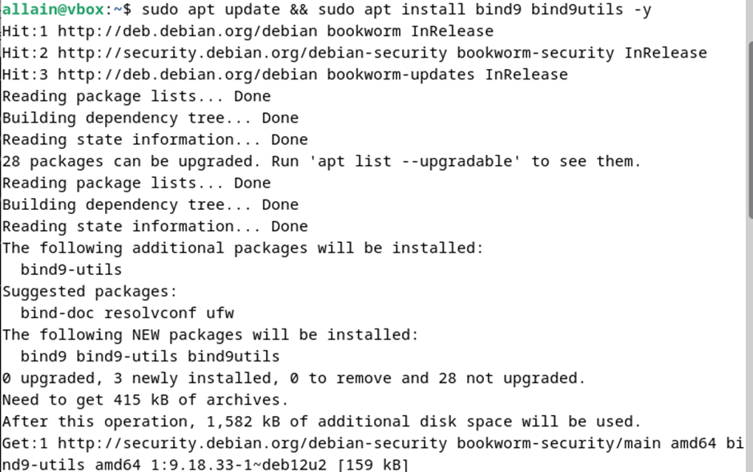

- Konfigurasi di /etc/bind/named.conf.
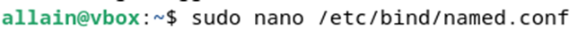
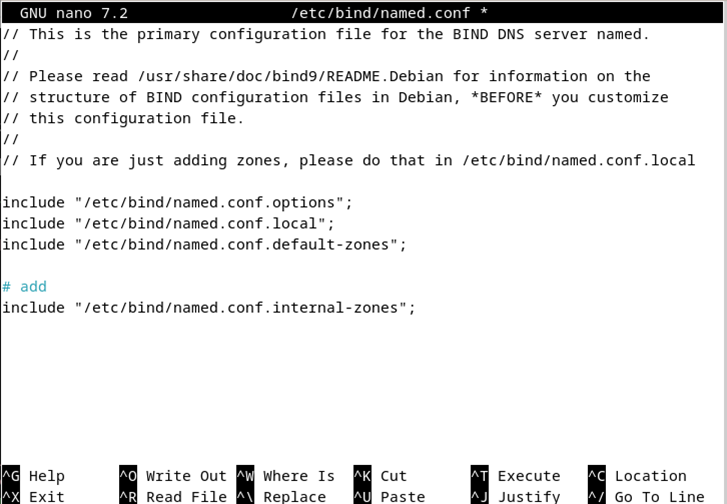

- Konfigurasi di /etc/bind/named.conf.options.
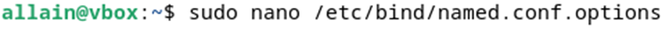
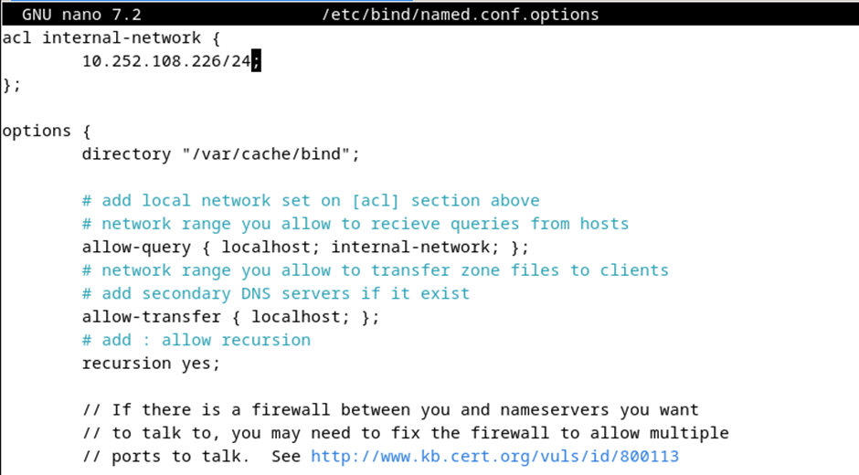
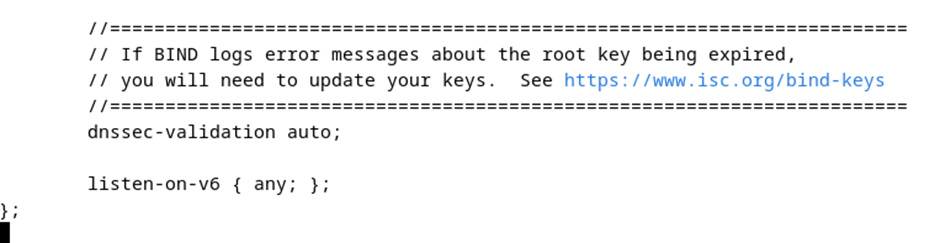

- Konfigurasi di /etc/bind/named.conf.internal-zones.

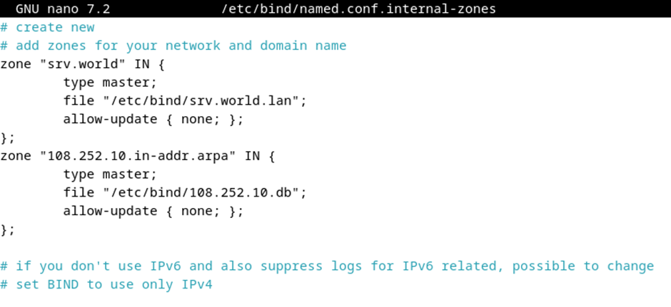

- Konfigurasi di /etc/default/named.

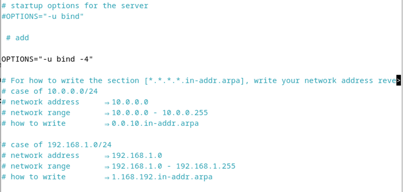

### 2. Configure Zone Files:
- Konfigurasi domain server sesuai nama kelompok.

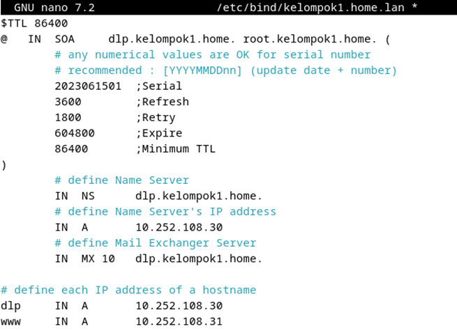

- Konfigurasi di /etc/bind/108.252.10.db.

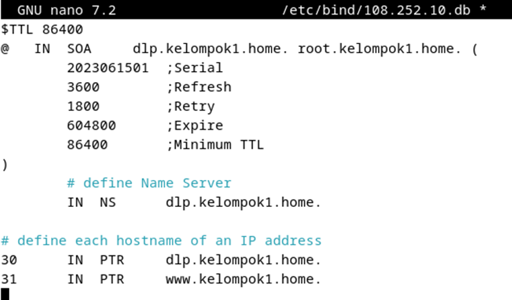

### 4. Verify Resolutions:
- Restart file named.

- Konfigurasi /etc/apt/resolv.conf.
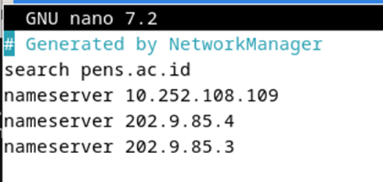

- Testing domain menggunakan dig.
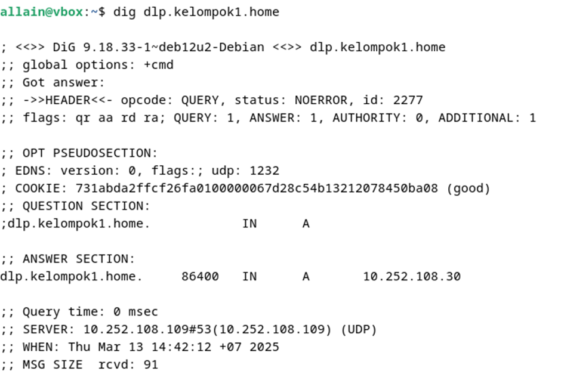
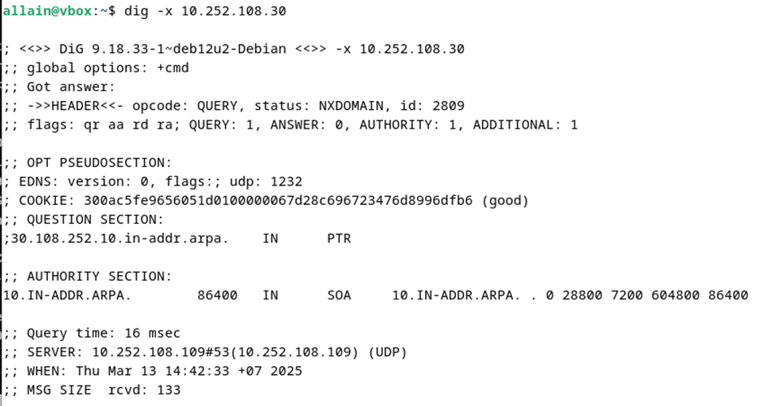

### Kesimpulan
