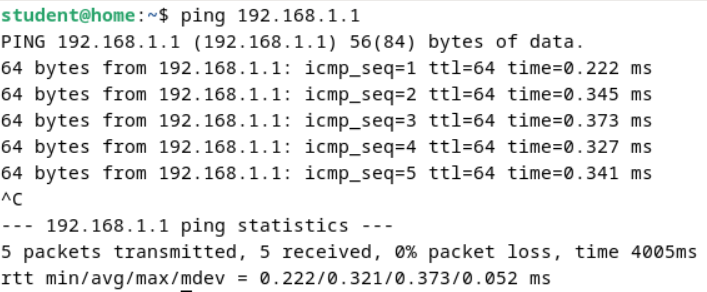

  <h1 style="text-align: center;font-weight: bold">LAPORAN RESMI WORKSHOP ADMINISTRASI JARINGAN</h1>

 

  
  <h4 style="text-align: center;">Dosen Pengampu : Dr. Ferry Astika Saputra, S.T., M.Sc.</h4>
  <h3 style="text-align: center;">Disusun Oleh : </h3>
  

    <strong>Nama : Achmad Risel Araby</strong> 
    <strong>Kelas : 2 D3 IT A</strong> 
    <strong>NRP : 3123500025</strong>
  

<h3 style="text-align: center;line-height: 1.5">Politeknik Elektronika Negeri Surabaya Departemen Teknik Informatika Dan Komputer Program Studi Teknik Informatika 2024/2025</h3>
  

## LAPORAN WORKSHOP 6: Koneksi VM 1 & VM 2

### Konfigurasi VM 1 (Debian Nogui)

Sebagaimana telah dijelaskan sebelumnya, salah satu mesin virtual (VM) akan berperan sebagai server, dan kita dapat menyebutnya sebagai VM 1. VM 1 dilengkapi dengan dua adapter jaringan, yakni Bridge Adapter (yang terhubung ke internet) dan Internal Network (yang terhubung ke client). Server ini berfungsi sebagai gateway yang memungkinkan client mengakses jaringan internet. Selain itu, VM 1 juga dikonfigurasi dengan beberapa layanan penting: Samba untuk mendukung transfer file, NTPSec untuk melakukan sinkronisasi waktu, serta Bind9 untuk mengelola domain lokal.

1. Konfigurasi network adapter.

Terdapat 2 adapter yakni bridge adapter dan internal network. Bridged adapter digunakan untuk terhubung ke internet, sedangkan internal network digunakan untuk terhubung dengan VM 2.

2. Konfigurasi IP Address pada Adapter 2 (Internal Network)

    Konfigurasi file /etc/network/interfaces seperti pada gambar berikut.
    
    Konfigurasi pada gambar melibatkan loopback interface (lo) untuk komunikasi internal dengan alamat 127.0.0.1, serta dua interface fisik: enp0s3 diatur menggunakan allow-hotplug untuk aktivasi otomatis saat perangkat terdeteksi, memperoleh alamat IPv4 secara dinamis via DHCP, dan menggunakan autoconfiguration untuk IPv6; enp0s8 dikonfigurasi dengan kombinasi allow-hotplug dan auto untuk aktif saat booting, menggunakan alamat IP statis 192.168.200.1, netmask 255.255.255.0, broadcast 192.168.200.255, network 192.168.200.0, DNS Cloudflare (1.1.1.1), serta autoconfiguration untuk IPv6.

3. Aktifkan forwarding di Server
    
    Hapus komentar pada baris **net.ipv4.ip_forward**. Pengaturan **net.ipv4.ip_forward=1** mengaktifkan kemampuan sistem Linux untuk meneruskan paket data IPv4 antar interface jaringan, memungkinkan perangkat berfungsi sebagai router atau gateway yang menghubungkan jaringan berbeda. Ini merupakan elemen kunci dalam implementasi NAT, VPN, dan solusi jaringan lainnya.

    Kemudian validasi dengan menjalankan perintah sysctl -p.
    

4. Konfigurasi Iptables
    Iptables merupakan utilitas yang digunakan untuk mengelola firewall di sistem operasi Linux. Alat ini berperan sebagai penyaring lalu lintas data, baik yang masuk maupun keluar dari sistem, dan dikenal juga sebagai "kumpulan aturan firewall".

    a. Instal Paket iptables & iptables-persistent
    

    b. Konfigurasi aturan iptables

    Modifikasi isi file /etc/iptables/rules.v4 sesuai gambar berikut.
    
    Pada konfigurasi /etc/iptables/rules.v4, terdapat dua tabel utama: **nat** dan **filter**. Di tabel **nat**, aturan `-A POSTROUTING -o enp0s3 -j MASQUERADE` digunakan untuk melakukan NAT masquerade pada interface **enp0s3**, memungkinkan sistem berfungsi sebagai gateway dengan menyembunyikan alamat IP internal menggunakan alamat IP publik dari **enp0s3**, sehingga memudahkan routing balik dan meningkatkan keamanan. Di tabel **filter**, beberapa aturan mengatur lalu lintas masuk, seperti: mengizinkan paket dari loopback (`-i lo`), koneksi SSH pada port 22, koneksi terkait atau sudah terjalin (`RELATED,ESTABLISHED`), serta lalu lintas dari jaringan internal (**enp0s8**), sementara lalu lintas dari interface luar (**enp0s3**) yang tidak memenuhi aturan akan ditolak (`DROP`) demi keamanan server.

5. Reboot
    
    Setelah semua konfigurasi berhasil dilakukan. Reboot vm dengan perintah sudo reboot.

### Konfigurasi NTP (NTPSec) Pada VM 1 (Debian Nogui)
1. Instalasi paket ntpsec.

2. Konfigurasi server NTP.

3. Restart service ntpsec Jalankan perintah systemctl restart ntpsec serta validasi dengan perintah ntpq -p.

### Konfigurasi File Server (Samba) Pada VM 1 (Debian Nogui)
1. Instal paket samba.

2. Buat direktori untuk dibagikan mkdir /home/share dan ubah permission agar bisa diakses chmod 777 /home/share.

3. Konfigutasi samba di file /etc/samba/smb.conf.

4. Restart service smbd.

### Konfigurasi DNS Server (Bind9) Pada VM 1 (Debian Nogui)
1. Instal paket dengan perintah apt -y install bind9 bind9utils.

2. Modifikasi file /etc/bind/named.conf.

3. Modifikasi file vi /etc/bind/named.conf.options.

4. Konfigurasi internal zone pada file /etc/bind/named.conf.internal-zones.

5. Konfigurasi file /etc/default/named.

6. Buat file sesuai dengan domain lokal.

7. Buat file sesuai dengan IP Address.

### Konfigurasi pada VM 2 (Debian GUI)
Konfigurasi VM 2 dengan alamat IP yang berada dalam jaringan yang sama dengan VM 1 (ens33), sehingga kedua vm tersebut dapat saling berkomunikasi.

Cek koneksi dengan pingke gateway.

Tes akses file dari Samba.

Tes DNS Server.

