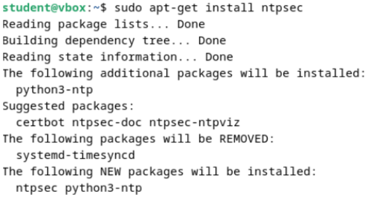

  <h1 style="text-align: center;font-weight: bold">LAPORAN RESMI WORKSHOP ADMINISTRASI JARINGAN</h1>

 

  
  <h4 style="text-align: center;">Dosen Pengampu : Dr. Ferry Astika Saputra, S.T., M.Sc.</h4>
  <h3 style="text-align: center;">Disusun Oleh : </h3>
  

    <strong>Nama : Achmad Risel Araby</strong> 
    <strong>Kelas : 2 D3 IT A</strong> 
    <strong>NRP : 3123500025</strong>
  

<h3 style="text-align: center;line-height: 1.5">Politeknik Elektronika Negeri Surabaya Departemen Teknik Informatika Dan Komputer Program Studi Teknik Informatika 2024/2025</h3>
  

## LAPORAN WORKSHOP 8: Migrasi NTP, DNS, SAMBA ke Jaringan Lab

Praktikum ini bertujuan untuk memindahkan pengaturan layanan NTP (Network Time Protocol), DNS (Domain Name System), dan SAMBA (server berbagi file) dari jaringan internal menuju jaringan lab, sesuai dengan pembagian kelompok masing-masing. Berikut adalah langkah-langkah yang harus dilakukan untuk melakukan konfigurasi tersebut.

### Konfigurasi NTP (NTPSec) Pada VM 1 (Server)

1. Instalai paket ntpsec

2. Konfigurasi NTP server

Berikan modifikasi server dengan mengganti server NTP

3. Restart service ntpsec Jalankan perintah systemctl restart ntpsec

4. Validasi NTP Server

### Instalasi dan Konfigurasi Samba

Samba adalah perangkat lunak open-source yang memungkinkan berbagi file dan printer antara sistem operasi Windows dan Unix-like (seperti Linux, macOS, dan lainnya). Samba mengimplementasikan protokol SMB/CIFS (Server Message Block/Common Internet File System), yang merupakan protokol berbagi file dan printer yang digunakan secara luas di jaringan Windows. Berikut langkah konfigurasinya.

1. Instalasi package Samba

2. Konfigurasi pada samba

3. Membuat sebuah file di direktori /home/share

4. Percobaan akses dari jaringan kelompok

5. Percobaan akses dari host jaringan kelompok lain

### Instalasi & Konfigurasi Bind9
DNS Server: 192.168.1.247

#### Konfigurasi DNS Server (Bind9) Pada Server

1. Instalasi paket dengan menjalankan perintah apt -y install bind9 bind9utils

2. Modifikasi file /etc/bind/named.conf

3. Modifikasi file vi /etc/bind/named.conf.options

4. Konfigurasi internal zone pada file /etc/bind/named.conf.internal-zones

5. Konfigurasi file /etc/default/named

6. Buat file sesuai dengan domain lokal

7. Buat file sesuai dengan IP Address

#### Tes DNS Server 1
Tes DNS Server dari jaringan dalam kelompok
