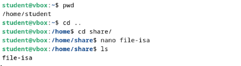
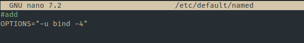
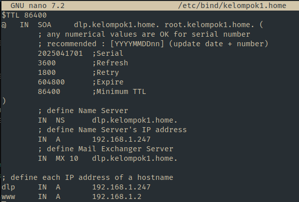

  <h1 style="text-align: center;font-weight: bold">LAPORAN RESMI WORKSHOP ADMINISTRASI JARINGAN</h1>

 

  
  <h4 style="text-align: center;">Dosen Pengampu : Dr. Ferry Astika Saputra, S.T., M.Sc.</h4>
  <h3 style="text-align: center;">Disusun Oleh : </h3>
  

    <strong>Nama : Achmad Risel Araby</strong> 
    <strong>Kelas : 2 D3 IT A</strong> 
    <strong>NRP : 3123500025</strong>
  

<h3 style="text-align: center;line-height: 1.5">Politeknik Elektronika Negeri Surabaya Departemen Teknik Informatika Dan Komputer Program Studi Teknik Informatika 2024/2025</h3>
  

## LAPORAN WORKSHOP 9: Migrasi NTP, DNS, SAMBA dan Apache2 ke Jaringan Lab (Kelompok 1)

Praktikum ini bertujuan untuk memindahkan konfigurasi NTP (Network Time Protocol), DNS (Domain Name System), dan SAMBA (file sharing server) dari jaringan internal network ke jaringan lab sesuai dengan kelompk masing-masing. Berikut langkah-langkah konfigurasinya.

#### Desain Tekologi
   

#### Konfigurasi NTP (NTPSec) Pada VM 1 (Server)

1. Instalai paket `ntpsec`

   

2. Konfigurasi server NTP

   

   Berikan modifikasi server dengan mengganti server NTP

3. Restart service ntpsec
   Jalankan perintah `systemctl restart ntpsec`

4. Validasi NTP Server
   

#### Instalasi dan Konfigurasi Samba

Samba adalah perangkat lunak open-source yang memungkinkan berbagi file dan printer antara sistem operasi Windows dan Unix-like (seperti Linux, macOS, dan lainnya). Samba mengimplementasikan protokol SMB/CIFS (Server Message Block/Common Internet File System), yang merupakan protokol berbagi file dan printer yang digunakan secara luas di jaringan Windows. Berikut langkah konfigurasinya.

#### Instalasi package Samba

 

#### Percobaan Akes FIle Samba

1. Konfigurasi pada samba

2. Membuat sebuah file di direktori /home/share

3. Percobaan akses dari jaringan kelompok

4. Percobaan akses dari host jaringan kelompok lain

### Konfigurasi Bind9

DNS Server: 192.168.1.247

#### Konfigurasi DNS Server (Bind9) Pada Server

1. Instalasi paket dengan menjalankan perintah `apt -y install bind9 bind9utils`
2. Modifikasi file `/etc/bind/named.conf`

   

3. Modifikasi file `vi /etc/bind/named.conf.options`

   

4. Konfigurasi internal zone pada file `/etc/bind/named.conf.internal-zones`

   

5. Konfigurasi file `/etc/default/named`

   

6. Buat file sesuai dengan domain lokal

   

7. Buat file sesuai dengan IP Address

   

#### Tes DNS Server 1

1. Tes DNS Server dari jaringan dalam kelompok

#### Konfigurasi Web Server (Apache 2)

1. Instalasi paket apache2
   Jalankan perintah berikut untuk menginstal Apache2:

   

2.  Pengaturan Dasar Apache2
   - ServerTokens: Edit /etc/apache2/conf-enabled/security.conf dan ubah baris:'

       

   Ini digunakan menyembunyikan informasi detail versi Apache pada header HTTP, meningkatkan keamanan.

   - DirectoryIndex: Edit /etc/apache2/mods-enabled/dir.conf dan atur urutan file index yang dicari ketika direktori diakses:

   

   - ServerName: Edit /etc/apache2/apache2.conf dan tambahkan baris berikut untuk      mendefinisikan nama server:
      

   Ini mencegah munculnya peringatan “Could not reliably determine the server's fully qualified domain name”.

   - ServerAdmin: Edit /etc/apache2/sites-enabled/000-default.conf dan ubah baris email admin:
   

3. Custom tampilan halaman 

   

4. Percobaan Akses

   

Dengan hasil yang terdapat dapat percobaan, berarti konfigurasiu web server sudah berhasil.